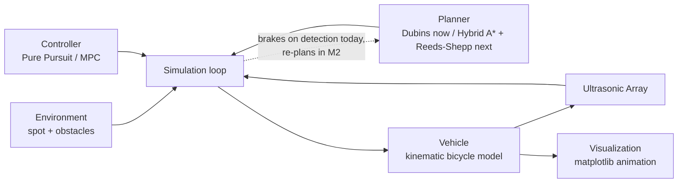

# Design

## 1. Problem statement & goals

This project simulates an autonomous vehicle parking itself into a perpendicular or parallel
spot, given a start pose, a goal spot, and a set of static obstacles. It covers the **planning
and control** stack of an autonomous parking system end-to-end in simulation:

- Given a start pose and a target spot, **plan** a kinematically-feasible path (forward and
  reverse) that avoids obstacles.
- **Track** that path with a closed-loop controller that issues speed and steering commands.
- **Sense** the environment with a simulated ultrasonic array and react to obstacles the planner
  didn't already account for (e.g. re-plan or brake).
- **Visualize** the result as an animated top-down view, suitable for a GIF.

Explicitly out of scope: perception (obstacles are given as ground-truth geometry, not detected
from raw sensor data), localization error (the vehicle's pose is known exactly), 3D/terrain, and
multi-agent/dynamic traffic. This is a planning+control simulation, not a full AV stack — that
scope boundary is deliberate so the project stays focused on the algorithms it's meant to
showcase rather than becoming a shallow attempt at everything.

## 2. System architecture



The simulation loop is the only component that knows about all the others; every other module
only depends on plain data (poses, paths, obstacle lists) so planner and controller
implementations are swappable without touching the loop:

1. **Environment** holds the parking spot geometry and static obstacles.
2. **Planner** computes a path once, up front, from the vehicle's start pose to the spot,
   respecting the vehicle's turning constraints and the known obstacles.
3. **Simulation loop**, each timestep:
   a. Queries the **sensor** for ranges to nearby obstacles.
   b. Passes the current pose + path to the **controller**, gets back `(v, delta)`.
   c. If the sensor detects something the planner didn't know about, triggers a re-plan instead
      of just braking.
   d. Advances the **vehicle** state by one timestep.
4. **Visualization** consumes the recorded pose history after the fact and renders it.

## 3. Vehicle model

Kinematic bicycle model — the standard simplification for low-speed maneuvers (parking) where
tire slip is negligible:

```
x'     = v * cos(theta)
y'     = v * sin(theta)
theta' = (v / L) * tan(delta)
```

where `L` is the wheelbase, `v` is speed (signed — negative means reverse), and `delta` is the
steering angle. All angles are in **radians** throughout the codebase (the original prototype's
bug — passing `theta=90.0` meaning degrees into a radians-only model — was exactly the kind of
unit mismatch this model is sensitive to, since `theta'` compounds every step).

`Vehicle` also carries `max_steer` (default 0.6 rad, ~34 degrees — a realistic passenger-car
limit) and exposes `turning_radius = wheelbase / tan(max_steer)`. This is the single source of
truth the planner and both controllers size themselves against — see Section 5 for why treating
it as a real physical constraint, rather than an afterthought, turned out to matter a lot more
than expected.

A full dynamic model (accounting for tire slip, mass, inertia) is deliberately not used: it adds
significant complexity for a regime (parking-lot speeds, <2 m/s) where it wouldn't change the
resulting paths enough to matter. This is called out explicitly here rather than left implicit,
since "why not the more complex model" is the kind of question this doc should pre-empt.

## 4. Sensor model

A simulated ultrasonic array: a fixed set of beam angles relative to the vehicle heading, each
cast as a ray against the obstacle set. Obstacles are circles (parametrized by center + radius),
so each beam's distance is the closest ray/circle intersection, computed analytically via the
quadratic formula rather than by discretized ray-marching (cheaper, exact, and simple to unit
test against hand-computed cases).

Each beam returns `max_range` if no obstacle is hit. Stretch goal: additive Gaussian noise on
returned ranges, to make the "does the controller handle noisy sensing" question meaningful —
noted here as a future extension (Section 9), not required for the core project.

## 5. Path planning

### What's built now: Dubins paths

The M1 baseline plans a single fixed **Dubins path** — the shortest path between two poses for a
forward-only car with a minimum turning radius — from the start pose straight to the spot. It
does not see obstacles at all; obstacle handling is purely reactive at the control layer (the
simulation loop brakes when the sensor array detects something close, see Section 2). That means
the vehicle can drive itself into a dead end: if an obstacle sits on the path, the car brakes and
stops, it never routes around it. Three of the five demo scenarios are built specifically to show
this limitation safely (the vehicle stalls, it doesn't collide) rather than pretend it doesn't
exist — see IMPLEMENTATION.md section 6.

An earlier version of this planner used a generic smooth (cubic Bezier) curve shaped only by the
start/goal positions and headings, with no reference to the vehicle's actual turning radius. It
looked reasonable and passed a casual glance, but for a heading change near 90 degrees (typical
perpendicular-parking geometry) compressed into a short chord, it produced curvature several
times tighter than the vehicle's `max_steer` allows — a smooth-looking path that was
kinematically impossible to drive. Both controllers failed to track it, for the correct reason:
there was nothing to successfully track. Dubins paths are built from exactly two arcs of the
vehicle's real turning radius plus a straight segment, so curvature is always either 0 or exactly
`1 / turning_radius`, never more — every generated path is drivable by construction, not by luck.
This is the kind of bug that's easy to miss by eyeballing a plotted curve and only shows up once
you check curvature against the vehicle's actual limits, which is why Section 7 calls this out
as a design decision rather than leaving it implicit.

### What's next: Hybrid A* + Reeds-Shepp (M2)

Two planners, to be used together, are the principled fix for the obstacle-avoidance gap above:

- **Reeds-Shepp curves**: the closed-form generalization of Dubins paths that also allows
  reverse gear — the textbook algorithm for car parking specifically. Used both as a standalone
  planner for the obstacle-free case (in place of Dubins) and as the local connection/heuristic
  inside Hybrid A*.
- **Hybrid A\***: search over a discretized `(x, y, theta)` state space, where each expansion
  step is a short arc consistent with the vehicle's turning-radius limits, and the heuristic
  combines Euclidean distance-to-goal with the cost of the unobstructed Reeds-Shepp path. This is
  what lets the planner route *around* obstacles instead of only reacting to them at close range:
  a single fixed Dubins/Reeds-Shepp path has no way to represent "go around," Hybrid A* does.

Alternatives considered:

- **RRT\*** — asymptotically optimal and simpler to implement than Hybrid A*, but produces
  jerkier, less repeatable paths for this structured, low-dimensional scenario (car parking in a
  mostly-open lot), where a grid search is tractable and gives smoother, more predictable output.
  Hybrid A* is the better fit for a *structured* environment; RRT* earns its keep in cluttered,
  high-dimensional spaces this project doesn't have.
- **Keep the fixed Dubins path, just add obstacle checks** — rejected for the same reason the
  Bezier curve was: it can't express "go around an obstacle in the way," only "stop in front of
  it."

## 6. Control

Two controllers, presented as a deliberate comparison rather than a single "best" choice:

| | Pure Pursuit (adaptive) | MPC |
|---|---|---|
| Approach | Geometric — chase a lookahead point on the path | Optimization — minimize predicted tracking error over a short horizon |
| Solve method | Closed-form (arctan2), O(path length) per step | Direct-shooting nonlinear program, `scipy.optimize.minimize(SLSQP)`, warm-started each step |
| Reverse handling | Direction flips when the lookahead point is behind the vehicle | Explicit in the model; `v` is simply a bounded optimization variable |
| Tuning surface | Lookahead distance, max speed/accel | Horizon length, tracking/effort/smoothness cost weights |
| Weakness | Reactive only — no margin when the path curvature is already at the vehicle's limit | ~2-3 ms per control step (SLSQP solve); more tuning parameters |

This comparison isn't just theoretical — running both controllers on the same Dubins paths
surfaced a real, measurable difference. A Dubins path sits *exactly* at the vehicle's curvature
limit by construction (Section 5), which leaves Pure Pursuit's reactive steering law zero margin:
any small lookahead-target misalignment demands more curvature than the vehicle can provide,
steering saturates, and on the tighter perpendicular-parking scenario Pure Pursuit overshoots
into a near-360-degree loop before recovering. MPC, by rolling out the actual dynamics over a
horizon and respecting the same steering bound as a hard constraint rather than reacting to it
after the fact, converges directly with no overshoot. Both controllers succeed reliably on the
scenarios with a clear path to the spot; the gap shows up specifically where the path is
curvature-saturated, which is exactly the regime the comparison table above predicts.

Pure Pursuit remains the default/baseline (it's simple, fast, and easy to reason about). MPC is
selectable per scenario via `demo.py --controller mpc`.

## 7. Design decisions & alternatives considered

- **Kinematic vs. dynamic bicycle model**: kinematic, see Section 3.
- **Hybrid A\* vs. RRT\***: Hybrid A*, see Section 5.
- **Grid resolution for Hybrid A\***: coarser cells reduce search time but risk missing narrow
  gaps between obstacles; the implementation should expose this as a tunable parameter rather
  than a hardcoded constant, since the right value is scenario-dependent.
- **Obstacles as circles, not polygons**: keeps the sensor/planner collision math analytic
  (closed-form ray/circle and pose/circle checks) instead of requiring a general polygon
  collision library; sufficient for representing parked cars/pillars as bounding circles.
- **Brake-trigger distance sized from stopping physics, not picked by feel**: `brake_distance`
  must exceed the vehicle's actual stopping distance (`v_max^2 / (2*a_max)`, ~1.4 m at this
  project's speeds/accel limits) plus margin, or the vehicle detects an obstacle in time but
  still can't decelerate fast enough to avoid it. An earlier, arbitrarily-chosen smaller value
  produced exactly that: real collisions in scenarios the vehicle should have safely stalled in.

## 8. Known limitations & assumptions

- Obstacles are static for the duration of a scenario (no moving pedestrians/cars).
- The vehicle's pose is known exactly — no localization noise or drift.
- 2D, flat ground plane only.
- Obstacles are approximated as circles, which over-estimates the footprint of non-circular
  obstacles (a conservative simplification, not a correctness bug).

## 9. Future extensions

- Learned parking policy (RL, e.g. trained via a simple gym-style wrapper around the simulation)
  compared against the planner+controller baseline.
- Dynamic obstacles (other vehicles, pedestrians) requiring re-planning mid-maneuver.
- Sensor noise model (Section 4) to test controller robustness under uncertainty.
- ROS2 bridge, to run the same planner/controller nodes against a Gazebo/Isaac Sim vehicle
  instead of the built-in kinematic simulator.
