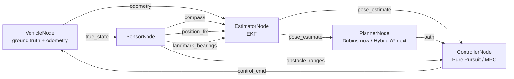

# Design

## 1. Problem statement & goals

This project simulates an autonomous vehicle parking itself into a perpendicular or parallel
spot, given a start pose, a goal spot, and a set of static obstacles. It covers the **planning
and control** stack of an autonomous parking system end-to-end in simulation:

- Given a start pose and a target spot, **plan** a kinematically-feasible path (forward and
  reverse) that avoids obstacles.
- **Track** that path with a closed-loop controller that issues speed and steering commands.
- **Sense** the environment with a simulated ultrasonic array and react to obstacles the planner
  didn't already account for (e.g. re-plan or brake).
- **Visualize** the result as an animated top-down view, suitable for a GIF.

Explicitly out of scope: mapping/SLAM (the environment's obstacle positions are known/mapped in
advance — the vehicle localizes against them, it doesn't build the map), 3D/terrain, and
multi-agent/dynamic traffic. Localization error is *not* out of scope, unlike an earlier version
of this document said — see Section 5. This is a planning+control+estimation simulation, not a
full AV stack — that scope boundary is deliberate so the project stays focused on the algorithms
it's meant to showcase rather than becoming a shallow attempt at everything.

## 2. System architecture

The system is a small **pub/sub node graph** (topics + typed messages, no real ROS2 dependency)
rather than one component calling the next directly:



Two properties of this graph matter more than the fact that it's "pub/sub" at all:

- **`true_state` is subscribed only by `SensorNode` and the harness's own evaluation logic** —
  never by the estimator, planner, or controller. That's the perception/reality boundary made
  structural rather than a comment: a real vehicle doesn't get to peek at its own ground-truth
  pose either, and nothing in this codebase can accidentally do so without adding a new
  subscription to a topic named `true_state`, which is easy to grep for and easy to review against.
- **Nodes only ever reference topic names and message types, never each other directly.** Adding
  a new planner or controller means writing a class that satisfies `Planner`/`Controller`
  (`interfaces.py`) and wrapping it in the corresponding node — nothing else in the graph changes.

Dispatch (`auto_park/messaging/bus.py`) is **synchronous and immediate**: `publish()` calls every
subscriber callback directly, in registration order, no threads or async queue. A real ROS2 graph
runs concurrently with nondeterministic message timing; this simulation trades that realism for
determinism, because reproducible tests and reproducible demo GIFs matter more here than
faithfully modeling DDS scheduling. That's a deliberate tradeoff, not a missing feature.

**Per tick** (`harness.py`), in a fixed order:

1. `VehicleNode` applies the previous tick's `control_cmd` to the real `Vehicle`, publishes
   `true_state` and noisy `odometry`. Publishing `odometry` synchronously triggers an EKF predict
   inside `EstimatorNode`, which republishes `pose_estimate` — which, on the very first tick,
   also triggers `PlannerNode` to plan once (see Section 6).
2. `SensorNode` (having received `true_state`) publishes `obstacle_ranges`, an always-on noisy
   `compass` reading, and — when due — a `position_fix` and/or `landmark_bearings`. Each of these
   synchronously triggers a further EKF correction and `pose_estimate` republish.
3. `ControllerNode.step()` is called explicitly by the harness (not reactively) exactly once,
   using the freshest `pose_estimate`/`path`/`obstacle_ranges` available, and publishes exactly
   one `control_cmd` for the *next* tick. This keeps "one control decision per tick" well-defined
   even though `pose_estimate` is republished several times a tick.

The harness itself subscribes to `true_state`, `pose_estimate`, and `path` purely to record
history for evaluation and visualization — it participates in the graph the same way any other
node would, it just happens to also be allowed to see ground truth.

## 3. Vehicle model

Kinematic bicycle model — the standard simplification for low-speed maneuvers (parking) where
tire slip is negligible:

```
x'     = v * cos(theta)
y'     = v * sin(theta)
theta' = (v / L) * tan(delta)
```

where `L` is the wheelbase, `v` is speed (signed — negative means reverse), and `delta` is the
steering angle. All angles are in **radians** throughout the codebase (the original prototype's
bug — passing `theta=90.0` meaning degrees into a radians-only model — was exactly the kind of
unit mismatch this model is sensitive to, since `theta'` compounds every step).

`Vehicle` also carries `max_steer` (default 0.6 rad, ~34 degrees — a realistic passenger-car
limit) and exposes `turning_radius = wheelbase / tan(max_steer)`. This is the single source of
truth the planner and both controllers size themselves against — see Section 6 for why treating
it as a real physical constraint, rather than an afterthought, turned out to matter a lot more
than expected.

A full dynamic model (accounting for tire slip, mass, inertia) is deliberately not used: it adds
significant complexity for a regime (parking-lot speeds, <2 m/s) where it wouldn't change the
resulting paths enough to matter. This is called out explicitly here rather than left implicit,
since "why not the more complex model" is the kind of question this doc should pre-empt.

Acceleration limiting (bounding how fast commanded speed can actually change, `a_max`) and
steering clamping to `max_steer` both live in `VehicleNode`, not in any controller. They're
physical actuator limits of the plant, not part of a control law — a controller is free to
command an unreachable `v_desired` or an over-limit `delta`; `VehicleNode` is what enforces what
the vehicle can actually do about it. Keeping that enforcement in exactly one place, rather than
duplicated in every controller, is what makes it trustworthy: no controller can silently bypass it.

## 4. Sensor model

A simulated ultrasonic array (`obstacle_ranges`): a fixed set of beam angles relative to the
vehicle heading, each cast as a ray against the obstacle set. Obstacles are circles (parametrized
by center + radius), so each beam's distance is the closest ray/circle intersection, computed
analytically via the quadratic formula rather than by discretized ray-marching (cheaper, exact,
and simple to unit test against hand-computed cases). Each beam returns `max_range` if no obstacle
is hit; `ControllerNode` brakes when the closest reading across all beams drops below
`brake_distance`.

Three more sensors, all noisy, feed the estimator (Section 5) rather than the controller directly:
a `compass` (heading only, always on, every tick), a low-rate `position_fix` (x, y only), and
opportunistic `landmark_bearings` against known obstacles. See Section 5 for why each exists and
what it corrects.

## 5. State estimation

**The vehicle's controller and planner never see ground truth.** Everything they act on comes
from an Extended Kalman Filter (`auto_park/estimation/ekf.py`) that fuses noisy odometry and
three noisy sensor types into a `[x, y, theta]` pose estimate with covariance. This is the classic
"odometry + periodic absolute correction" mobile-robot localization pattern (Thrun, Burgard & Fox,
*Probabilistic Robotics*, ch. 7) — localization, not SLAM: obstacle/landmark positions are assumed
known in advance (they come straight from `Environment`), the filter only estimates the vehicle's
own pose against them.

**Predict** (every tick, driven by noisy odometry — not the commanded control, which is what
makes this dead reckoning): propagate the mean through the same nonlinear bicycle-model equations
as `Vehicle.update`, linearized via its state Jacobian `F`. Process noise uses the
**control-dependent "velocity motion model"** formulation (same reference, ch. 5) rather than a
fixed, arbitrarily-sized `Q`: `Q = V @ M @ Vᵀ`, where `M` is the odometry noise covariance and
`V = df/d(v, delta)` is the motion model's Jacobian with respect to its *inputs*. This ties how
fast uncertainty grows during prediction directly to how noisy the odometry actually is, instead
of guessing a growth rate independently of the sensor supposedly driving it — the difference
matters: an arbitrary fixed `Q` would grow (or shrink) the covariance ellipse drawn in the demo
animation (`visualization/animate.py`) without any real connection to the odometry noise
parameters it's sitting next to in the config.

**Correct**, three independent measurement types, each with a linear or linearized `H`:

- **Compass** (`H = [0, 0, 1]`, every tick): keeps heading from drifting unboundedly even with
  zero landmarks in view. Without this, the two obstacle-free scenarios (nothing to take a
  landmark bearing on) would have no heading correction at all and would likely fail once noise
  entered the loop — this was in fact observed while building it (see Section 7).
- **Position fix** (`H = [[1,0,0],[0,1,0]]`, every ~10 ticks, moderate noise): models a
  garage-style RTLS/UWB-anchor fix, a real deployed technique for indoor/garage vehicle
  localization — not an implausible "GPS in a parking garage." Rank-deficient by design (doesn't
  observe heading) — a genuine partial-observability setup, not a toy one.
- **Landmark range-bearing** (nonlinear `h(x, landmark)`, standard range-bearing Jacobian,
  opportunistic — only when an obstacle is within sensor range): what makes this a genuine
  sensor-fusion EKF rather than a linear Kalman filter wearing an EKF's name — both the
  *prediction* and (for this measurement type) the *correction* step are nonlinear.

**Collision and success are always evaluated against true state**, in the harness — never against
the estimate. The estimate is what the vehicle acts on; "did it actually hit something" has to be
ground truth, or the test suite would be validating the filter's honesty about its own errors
instead of actual safety.

Initial pose is assumed roughly known (`x0` = true start pose, with a modest initial covariance,
not zero) — a common simplifying assumption that distinguishes ordinary localization/tracking
from the harder "kidnapped robot" global relocalization problem, which is out of scope here.

### Validation against real data

`tests/test_ekf.py` only ever validates the filter against noise the project itself generates —
that proves the *implementation* is self-consistent, but not that it behaves sensibly on a real,
messy trajectory nobody hand-picked to be filter-friendly. `auto_park/validation/` closes that
gap: it replays a real driven trajectory from the **KITTI Odometry benchmark**'s ground-truth
poses (`auto_park/data/kitti/excerpt_poses.txt` — 300 frames of sequence 09, chosen specifically
for having real turns, not a straight highway stretch, so heading estimation is actually
exercised) through the *same, unmodified* `ExtendedKalmanFilter`, using the *same* noise defaults
as `SensorNode`/`VehicleNode`.

KITTI records no steering angle, only speed and yaw rate, so each step's true `(v, yaw_rate)` is
converted to the `(v, delta)` the bicycle-model `predict()` expects via
`delta = atan2(wheelbase * yaw_rate, v)` — a pure adapter, not a second process model; the EKF
class itself needed zero changes. Frame-to-frame timing isn't included in the poses-only
download, so frames are assumed uniformly spaced at the Velodyne's nominal 10 Hz — an
approximation, stated as one rather than silently assumed. Ground-plane position and heading are
extracted from KITTI's row-major `[R|t]` camera-frame pose matrices using camera **x**/**z** as
the ground plane and rotation about camera **y** as heading — verified empirically (not just
derived on paper) by checking that the extracted heading tracks the actual direction of travel
between consecutive frames on a real turning sequence (mean deviation ~0.12 rad, consistent with
real vehicle slip and finite-difference noise, not a convention bug).

The validation runs two passes over the *identical* noisy odometry stream — the EKF (predict +
corrections) and dead-reckoning-only (predict only, no corrections) — so the comparison isolates
exactly what the corrections buy you. On the committed excerpt: **0.85 m RMSE with corrections
vs. 4.97 m without — an 83% error reduction**, on a real trajectory the filter was never tuned
against. `tests/test_kitti_ekf_validation.py` asserts the EKF strictly beats dead-reckoning-only
(the robust claim — no arbitrary accuracy threshold to pick) rather than asserting a specific
RMSE number, since the exact figure is a property of this one excerpt, not a guarantee.

## 6. Path planning

### What's built now: Dubins paths

The M1 baseline plans a single fixed **Dubins path** — the shortest path between two poses for a
forward-only car with a minimum turning radius — from the start pose straight to the spot. It
does not see obstacles at all; obstacle handling is purely reactive at the control layer (the
simulation loop brakes when the sensor array detects something close, see Section 2). That means
the vehicle can drive itself into a dead end: if an obstacle sits on the path, the car brakes and
stops, it never routes around it. Three of the five demo scenarios are built specifically to show
this limitation safely (the vehicle stalls, it doesn't collide) rather than pretend it doesn't
exist — see IMPLEMENTATION.md section 6.

An earlier version of this planner used a generic smooth (cubic Bezier) curve shaped only by the
start/goal positions and headings, with no reference to the vehicle's actual turning radius. It
looked reasonable and passed a casual glance, but for a heading change near 90 degrees (typical
perpendicular-parking geometry) compressed into a short chord, it produced curvature several
times tighter than the vehicle's `max_steer` allows — a smooth-looking path that was
kinematically impossible to drive. Both controllers failed to track it, for the correct reason:
there was nothing to successfully track. Dubins paths are built from exactly two arcs of the
vehicle's real turning radius plus a straight segment, so curvature is always either 0 or exactly
`1 / turning_radius`, never more — every generated path is drivable by construction, not by luck.
This is the kind of bug that's easy to miss by eyeballing a plotted curve and only shows up once
you check curvature against the vehicle's actual limits, which is why Section 8 calls this out
as a design decision rather than leaving it implicit.

### What's next: Hybrid A* + Reeds-Shepp (M2)

Two planners, to be used together, are the principled fix for the obstacle-avoidance gap above:

- **Reeds-Shepp curves**: the closed-form generalization of Dubins paths that also allows
  reverse gear — the textbook algorithm for car parking specifically. Used both as a standalone
  planner for the obstacle-free case (in place of Dubins) and as the local connection/heuristic
  inside Hybrid A*.
- **Hybrid A\***: search over a discretized `(x, y, theta)` state space, where each expansion
  step is a short arc consistent with the vehicle's turning-radius limits, and the heuristic
  combines Euclidean distance-to-goal with the cost of the unobstructed Reeds-Shepp path. This is
  what lets the planner route *around* obstacles instead of only reacting to them at close range:
  a single fixed Dubins/Reeds-Shepp path has no way to represent "go around," Hybrid A* does.

Alternatives considered:

- **RRT\*** — asymptotically optimal and simpler to implement than Hybrid A*, but produces
  jerkier, less repeatable paths for this structured, low-dimensional scenario (car parking in a
  mostly-open lot), where a grid search is tractable and gives smoother, more predictable output.
  Hybrid A* is the better fit for a *structured* environment; RRT* earns its keep in cluttered,
  high-dimensional spaces this project doesn't have.
- **Keep the fixed Dubins path, just add obstacle checks** — rejected for the same reason the
  Bezier curve was: it can't express "go around an obstacle in the way," only "stop in front of
  it."

## 7. Control

Two controllers, presented as a deliberate comparison rather than a single "best" choice. Both
act purely on `pose_estimate`, never on ground truth — `Controller.control()` takes anything with
`.x/.y/.theta` (`interfaces.HasPose`), so the same controller code runs unchanged whether it's
handed a real `Vehicle` or a `PoseEstimateMsg`.

| | Pure Pursuit (adaptive) | MPC |
|---|---|---|
| Approach | Geometric — chase a lookahead point on the path | Optimization — minimize predicted tracking error over a short horizon |
| Solve method | Closed-form (arctan2), O(path length) per step | Direct-shooting nonlinear program, `scipy.optimize.minimize(SLSQP)`, warm-started each step |
| Reverse handling | Direction flips when the lookahead point is behind the vehicle | Explicit in the model; `v` is simply a bounded optimization variable |
| Tuning surface | Lookahead distance, max speed/accel | Horizon length, tracking/effort/smoothness cost weights |
| Weakness | Reactive only — no margin when the path curvature is already at the vehicle's limit | ~2-3 ms per control step (SLSQP solve); more tuning parameters |

This comparison isn't just theoretical — running both controllers on the same Dubins paths
surfaced a real, measurable difference. A Dubins path sits *exactly* at the vehicle's curvature
limit by construction (Section 6), which leaves Pure Pursuit's reactive steering law zero margin:
any small lookahead-target misalignment demands more curvature than the vehicle can provide,
steering saturates, and on the tighter perpendicular-parking scenario Pure Pursuit overshoots
into a near-360-degree loop before recovering. MPC, by rolling out the actual dynamics over a
horizon and respecting the same steering bound as a hard constraint rather than reacting to it
after the fact, converges directly with no overshoot. Both controllers succeed reliably on the
scenarios with a clear path to the spot; the gap shows up specifically where the path is
curvature-saturated, which is exactly the regime the comparison table above predicts.

Once estimation noise entered the loop (Section 5), the same gap showed up again in a second
form: Pure Pursuit's near-goal behavior settles into a small, persistent limit cycle (a known
Pure Pursuit property — the lookahead target snaps to the final path point once everything's
within `lookahead`, so the vehicle orbits it rather than converging exactly onto it), and with
noisy position feedback that cycle's radius is comparable to the original success tolerance.
That's why `tol` is 0.4 m (loosened from a pre-estimation 0.3 m) and why the test suite evaluates
success as a **rate across 5 seeds**, not single-run determinism — asserting a threshold instead
of 100% is the statistically honest way to validate a controller under real sensor noise, rather
than picking a lucky seed and calling it done.

Pure Pursuit remains the default/baseline (it's simple, fast, and easy to reason about). MPC is
selectable per scenario via `demo.py --controller mpc`.

## 8. Design decisions & alternatives considered

- **Kinematic vs. dynamic bicycle model**: kinematic, see Section 3.
- **Hybrid A\* vs. RRT\***: Hybrid A*, see Section 6.
- **Control-dependent EKF process noise vs. a fixed Q**: see Section 5.
- **Synchronous pub/sub dispatch vs. a real async executor**: determinism over realistic timing,
  see Section 2.
- **Grid resolution for Hybrid A\***: coarser cells reduce search time but risk missing narrow
  gaps between obstacles; the implementation should expose this as a tunable parameter rather
  than a hardcoded constant, since the right value is scenario-dependent.
- **Obstacles as circles, not polygons**: keeps the sensor/planner collision math analytic
  (closed-form ray/circle and pose/circle checks) instead of requiring a general polygon
  collision library; sufficient for representing parked cars/pillars as bounding circles. The
  ego vehicle's own collision footprint (`VEHICLE_RADIUS` in `harness.py`) is modeled the same
  way and has to be on the same scale as the obstacles it shares the lot with (1.0 m, vs. ~1.3 m
  for a parked car) — an earlier, much smaller placeholder value (0.3 m) made the vehicle roughly
  four times "thinner" than the cars around it for collision purposes, which under-reports real
  collisions rather than causing loud failures, exactly the kind of bug that's easy to miss.
- **Brake-trigger distance sized from stopping physics *and* the vehicle's own size, not picked
  by feel**: `brake_distance` must exceed stopping distance (`v_max^2 / (2*a_max)`, ~1.4 m at
  this project's speeds/accel limits) **plus `VEHICLE_RADIUS`**, plus margin — not stopping
  distance alone. The sensor reading it's compared against measures from the vehicle's center to
  the obstacle's *surface*, but collision is checked center-to-center against `VEHICLE_RADIUS +
  obstacle.radius`, so the vehicle's own radius is part of the required margin, not just how
  fast it can stop. Missing that term (an earlier version did) produces the same failure mode
  either way: the vehicle detects the obstacle in time but still can't stop clear of it.

## 9. Known limitations & assumptions

- Obstacles are static for the duration of a scenario (no moving pedestrians/cars).
- Localization, not SLAM: landmark (obstacle) positions are assumed known in advance. The vehicle
  estimates its own pose against a known map; it doesn't build one.
- Single-hypothesis estimation: the EKF assumes a unimodal Gaussian belief. A genuinely ambiguous
  situation (e.g. two landmarks that look identical from certain angles) isn't modeled — that's
  what particle filters are for, and it's an explicit non-goal here (Section 10).
- No sensor dropout/failure modeling — every sensor is assumed to report every tick it's due,
  possibly noisy but never missing or stale.
- 2D, flat ground plane only.
- Obstacles are approximated as circles, which over-estimates the footprint of non-circular
  obstacles (a conservative simplification, not a correctness bug).

## 10. Future extensions

- Learned parking policy (RL, e.g. trained via a simple gym-style wrapper around the simulation)
  compared against the planner+controller baseline.
- Dynamic obstacles (other vehicles, pedestrians) requiring re-planning mid-maneuver.
- Sensor dropout/latency modeling, to test the estimator's (and controller's) robustness when a
  measurement is late or simply doesn't arrive, not just when it's noisy.
- Particle filter or UKF as an alternative to the EKF, for a genuine multi-modal or
  strongly-nonlinear comparison point (the EKF's linearization is a fine approximation at these
  turning rates, but it's an approximation, and demonstrating *why* it's usually good enough here
  — rather than just asserting it — would be a stronger claim than the current filter-consistency
  test alone provides).
- ROS2 bridge: the node/topic boundaries in `auto_park/nodes/` and `auto_park/messaging/` were
  drawn deliberately close to how a real ROS2 graph would be structured, specifically so that
  swapping the in-process `Bus` for real ROS2 topics later wouldn't require redesigning the nodes
  themselves — only how they publish/subscribe.
