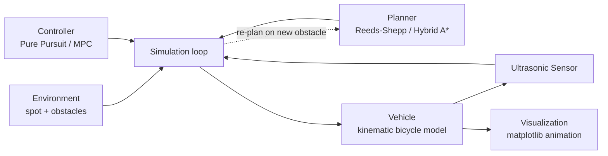

# Design

## 1. Problem statement & goals

This project simulates an autonomous vehicle parking itself into a perpendicular or parallel
spot, given a start pose, a goal spot, and a set of static obstacles. It covers the **planning
and control** stack of an autonomous parking system end-to-end in simulation:

- Given a start pose and a target spot, **plan** a kinematically-feasible path (forward and
  reverse) that avoids obstacles.
- **Track** that path with a closed-loop controller that issues speed and steering commands.
- **Sense** the environment with a simulated ultrasonic array and react to obstacles the planner
  didn't already account for (e.g. re-plan or brake).
- **Visualize** the result as an animated top-down view, suitable for a GIF.

Explicitly out of scope: perception (obstacles are given as ground-truth geometry, not detected
from raw sensor data), localization error (the vehicle's pose is known exactly), 3D/terrain, and
multi-agent/dynamic traffic. This is a planning+control simulation, not a full AV stack — that
scope boundary is deliberate so the project stays focused on the algorithms it's meant to
showcase rather than becoming a shallow attempt at everything.

## 2. System architecture



The simulation loop is the only component that knows about all the others; every other module
only depends on plain data (poses, paths, obstacle lists) so planner and controller
implementations are swappable without touching the loop:

1. **Environment** holds the parking spot geometry and static obstacles.
2. **Planner** computes a path once, up front, from the vehicle's start pose to the spot,
   respecting the vehicle's turning constraints and the known obstacles.
3. **Simulation loop**, each timestep:
   a. Queries the **sensor** for ranges to nearby obstacles.
   b. Passes the current pose + path to the **controller**, gets back `(v, delta)`.
   c. If the sensor detects something the planner didn't know about, triggers a re-plan instead
      of just braking.
   d. Advances the **vehicle** state by one timestep.
4. **Visualization** consumes the recorded pose history after the fact and renders it.

## 3. Vehicle model

Kinematic bicycle model — the standard simplification for low-speed maneuvers (parking) where
tire slip is negligible:

```
x'     = v * cos(theta)
y'     = v * sin(theta)
theta' = (v / L) * tan(delta)
```

where `L` is the wheelbase, `v` is speed (signed — negative means reverse), and `delta` is the
steering angle. All angles are in **radians** throughout the codebase (the current prototype's
bug — passing `theta=90.0` meaning degrees into a radians-only model — is exactly the kind of
unit mismatch this model is sensitive to, since `theta'` compounds every step).

A full dynamic model (accounting for tire slip, mass, inertia) is deliberately not used: it adds
significant complexity for a regime (parking-lot speeds, <2 m/s) where it wouldn't change the
resulting paths enough to matter. This is called out explicitly here rather than left implicit,
since "why not the more complex model" is the kind of question this doc should pre-empt.

## 4. Sensor model

A simulated ultrasonic array: a fixed set of beam angles relative to the vehicle heading, each
cast as a ray against the obstacle set. Obstacles are circles (parametrized by center + radius),
so each beam's distance is the closest ray/circle intersection, computed analytically via the
quadratic formula rather than by discretized ray-marching (cheaper, exact, and simple to unit
test against hand-computed cases).

Each beam returns `max_range` if no obstacle is hit. Stretch goal: additive Gaussian noise on
returned ranges, to make the "does the controller handle noisy sensing" question meaningful —
noted here as a future extension (Section 9), not required for the core project.

## 5. Path planning

The current prototype always generates the same fixed quadratic Bezier curve into the spot,
regardless of obstacles — obstacles are only handled reactively, by braking the vehicle if
something is close in front. That means the vehicle can drive itself into a dead end: if an
obstacle sits on the fixed curve, the car just stops, it never routes around it.

Two planners, used together:

- **Reeds-Shepp curves**: the classical closed-form solution for the shortest path between two
  poses for a car that can move forward and backward, respecting a minimum turning radius. This
  is the textbook algorithm for exactly this problem (car parking with reverse gear), and is
  used here both as a standalone planner for the obstacle-free case and as the local
  connection/heuristic inside Hybrid A*.
- **Hybrid A\***: search over a discretized `(x, y, theta)` state space, where each expansion
  step is a short arc consistent with the vehicle's turning-radius limits, and the heuristic
  combines Euclidean distance-to-goal with the cost of the unobstructed Reeds-Shepp path. This
  is what lets the planner route *around* obstacles instead of only reacting to them at close
  range: the fixed-curve approach has no way to represent "go around," Hybrid A* does.

Alternatives considered:

- **RRT\*** — asymptotically optimal and simpler to implement than Hybrid A*, but produces
  jerkier, less repeatable paths for this structured, low-dimensional scenario (car parking in a
  mostly-open lot), where a grid search is tractable and gives smoother, more predictable output.
  Hybrid A* is the better fit for a *structured* environment; RRT* earns its keep in cluttered,
  high-dimensional spaces this project doesn't have.
- **Keep the fixed Bezier curve, just add obstacle checks** — rejected because it can't express
  "go around an obstacle in the way," only "stop in front of it."

## 6. Control

Two controllers, presented as a deliberate comparison rather than a single "best" choice:

| | Pure Pursuit (adaptive) | Linear MPC |
|---|---|---|
| Approach | Geometric — chase a lookahead point on the path | Optimization — minimize predicted tracking error over a horizon |
| Reverse handling | Direction flips when the lookahead point is behind the vehicle | Explicit in the model; can be penalized/optimized directly |
| Computational cost | O(path length) per step, trivial | Solves a small QP per step |
| Tuning surface | Lookahead distance, max speed/accel | Horizon length, state/input cost weights |
| Weakness | Reactive only — doesn't account for future path curvature | More expensive; performance depends on linearization validity at each step |

Pure Pursuit remains the default/baseline (it's simple, fast, and already validated in the
prototype). MPC is added as a second controller selectable per scenario, to demonstrate the
predictive/optimization-based alternative and make the tradeoffs concrete rather than
theoretical — the same scenario can be run with either controller and the resulting paths
compared directly.

## 7. Design decisions & alternatives considered

- **Kinematic vs. dynamic bicycle model**: kinematic, see Section 3.
- **Hybrid A\* vs. RRT\***: Hybrid A*, see Section 5.
- **Grid resolution for Hybrid A\***: coarser cells reduce search time but risk missing narrow
  gaps between obstacles; the implementation should expose this as a tunable parameter rather
  than a hardcoded constant, since the right value is scenario-dependent.
- **Obstacles as circles, not polygons**: keeps the sensor/planner collision math analytic
  (closed-form ray/circle and pose/circle checks) instead of requiring a general polygon
  collision library; sufficient for representing parked cars/pillars as bounding circles.

## 8. Known limitations & assumptions

- Obstacles are static for the duration of a scenario (no moving pedestrians/cars).
- The vehicle's pose is known exactly — no localization noise or drift.
- 2D, flat ground plane only.
- Obstacles are approximated as circles, which over-estimates the footprint of non-circular
  obstacles (a conservative simplification, not a correctness bug).

## 9. Future extensions

- Learned parking policy (RL, e.g. trained via a simple gym-style wrapper around the simulation)
  compared against the planner+controller baseline.
- Dynamic obstacles (other vehicles, pedestrians) requiring re-planning mid-maneuver.
- Sensor noise model (Section 4) to test controller robustness under uncertainty.
- ROS2 bridge, to run the same planner/controller nodes against a Gazebo/Isaac Sim vehicle
  instead of the built-in kinematic simulator.
