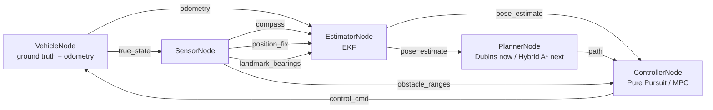

# Design

## 1. Problem statement & goals

This project covers two driving regimes on one shared architecture: **parking-lot maneuvers**
(Sections 2-10 below — planning, control, and estimation for perpendicular/parallel parking at
<2 m/s) and, starting with adaptive cruise control (Section 11), a growing **highway driving**
mode (longitudinal control now; lane centering, richer sensor fusion, and intersection
navigation are next — Section 12). Both share the same pub/sub node architecture, the same
`ExtendedKalmanFilter`, and the same "classical/reactive vs. optimization-based" controller
comparison device, applied to whatever the driving task actually is.

The parking mode covers **planning and control** for autonomous parking end-to-end in
simulation:

- Given a start pose and a target spot, **plan** a kinematically-feasible path (forward and
  reverse) that avoids obstacles.
- **Track** that path with a closed-loop controller that issues speed and steering commands.
- **Sense** the environment with a simulated ultrasonic array and react to obstacles the planner
  didn't already account for (e.g. re-plan or brake).
- **Visualize** the result as an animated top-down view, suitable for a GIF.

Explicitly out of scope, project-wide: mapping/SLAM (obstacle/landmark positions are known/mapped
in advance — the vehicle localizes against them, it doesn't build the map), 3D/terrain, and
perception-level sensor fusion (detecting/tracking *other* agents from raw camera/lidar data —
the highway mode's "sensor fusion" milestone, Section 12, extends the *ego* pose estimator, the
same kind of fusion already built for parking, not object detection). This is a
planning+control+estimation simulation, not a full production AV stack — that scope boundary is
deliberate so the project stays focused on demonstrating the algorithms rather than becoming a
shallow attempt at everything a real AV company's stack does.

## 2. System architecture

The system is a small **pub/sub node graph** (topics + typed messages, no real ROS2 dependency)
rather than one component calling the next directly:



Two properties of this graph matter more than the fact that it's "pub/sub" at all:

- **`true_state` is subscribed only by `SensorNode` and the harness's own evaluation logic** —
  never by the estimator, planner, or controller. That's the perception/reality boundary made
  structural rather than a comment: a real vehicle doesn't get to peek at its own ground-truth
  pose either, and nothing in this codebase can accidentally do so without adding a new
  subscription to a topic named `true_state`, which is easy to grep for and easy to review against.
- **Nodes only ever reference topic names and message types, never each other directly.** Adding
  a new planner or controller means writing a class that satisfies `Planner`/`Controller`
  (`interfaces.py`) and wrapping it in the corresponding node — nothing else in the graph changes.

Dispatch (`core/messaging/bus.py`) is **synchronous and immediate**: `publish()` calls every
subscriber callback directly, in registration order, no threads or async queue. A real ROS2 graph
runs concurrently with nondeterministic message timing; this simulation trades that realism for
determinism, because reproducible tests and reproducible demo GIFs matter more here than
faithfully modeling DDS scheduling. That's a deliberate tradeoff, not a missing feature.

**Per tick** (`harness.py`), in a fixed order:

1. `VehicleNode` applies the previous tick's `control_cmd` to the real `Vehicle`, publishes
   `true_state` and noisy `odometry`. Publishing `odometry` synchronously triggers an EKF predict
   inside `EstimatorNode`, which republishes `pose_estimate` — which, on the very first tick,
   also triggers `PlannerNode` to plan once (see Section 6).
2. `SensorNode` (having received `true_state`) publishes `obstacle_ranges`, an always-on noisy
   `compass` reading, and — when due — a `position_fix` and/or `landmark_bearings`. Each of these
   synchronously triggers a further EKF correction and `pose_estimate` republish.
3. `ControllerNode.step()` is called explicitly by the harness (not reactively) exactly once,
   using the freshest `pose_estimate`/`path`/`obstacle_ranges` available, and publishes exactly
   one `control_cmd` for the *next* tick. This keeps "one control decision per tick" well-defined
   even though `pose_estimate` is republished several times a tick.

The harness itself subscribes to `true_state`, `pose_estimate`, and `path` purely to record
history for evaluation and visualization — it participates in the graph the same way any other
node would, it just happens to also be allowed to see ground truth.

## 3. Vehicle model

Kinematic bicycle model — the standard simplification for low-speed maneuvers (parking) where
tire slip is negligible:

```
x'     = v * cos(theta)
y'     = v * sin(theta)
theta' = (v / L) * tan(delta)
```

where `L` is the wheelbase, `v` is speed (signed — negative means reverse), and `delta` is the
steering angle. All angles are in **radians** throughout the codebase (the original prototype's
bug — passing `theta=90.0` meaning degrees into a radians-only model — was exactly the kind of
unit mismatch this model is sensitive to, since `theta'` compounds every step).

`Vehicle` also carries `max_steer` (default 0.6 rad, ~34 degrees — a realistic passenger-car
limit) and exposes `turning_radius = wheelbase / tan(max_steer)`. This is the single source of
truth the planner and both controllers size themselves against — see Section 6 for why treating
it as a real physical constraint, rather than an afterthought, turned out to matter a lot more
than expected.

A full dynamic model (accounting for tire slip, mass, inertia) is deliberately not used: it adds
significant complexity for a regime (parking-lot speeds, <2 m/s) where it wouldn't change the
resulting paths enough to matter. This is called out explicitly here rather than left implicit,
since "why not the more complex model" is the kind of question this doc should pre-empt.

Acceleration limiting (bounding how fast commanded speed can actually change, `a_max`) and
steering clamping to `max_steer` both live in `VehicleNode`, not in any controller. They're
physical actuator limits of the plant, not part of a control law — a controller is free to
command an unreachable `v_desired` or an over-limit `delta`; `VehicleNode` is what enforces what
the vehicle can actually do about it. Keeping that enforcement in exactly one place, rather than
duplicated in every controller, is what makes it trustworthy: no controller can silently bypass it.

## 4. Sensor model

A simulated ultrasonic array (`obstacle_ranges`): a fixed set of beam angles relative to the
vehicle heading, each cast as a ray against the obstacle set. Obstacles are circles (parametrized
by center + radius), so each beam's distance is the closest ray/circle intersection, computed
analytically via the quadratic formula rather than by discretized ray-marching (cheaper, exact,
and simple to unit test against hand-computed cases). Each beam returns `max_range` if no obstacle
is hit; `ControllerNode` brakes when the closest reading across all beams drops below
`brake_distance`.

Three more sensors, all noisy, feed the estimator (Section 5) rather than the controller directly:
a `compass` (heading only, always on, every tick), a low-rate `position_fix` (x, y only), and
opportunistic `landmark_bearings` against known obstacles. See Section 5 for why each exists and
what it corrects.

## 5. State estimation

**The vehicle's controller and planner never see ground truth.** Everything they act on comes
from an Extended Kalman Filter (`core/estimation/ekf.py`) that fuses noisy odometry and
three noisy sensor types into a `[x, y, theta]` pose estimate with covariance. This is the classic
"odometry + periodic absolute correction" mobile-robot localization pattern (Thrun, Burgard & Fox,
*Probabilistic Robotics*, ch. 7) — localization, not SLAM: obstacle/landmark positions are assumed
known in advance (they come straight from `Environment`), the filter only estimates the vehicle's
own pose against them.

**Predict** (every tick, driven by noisy odometry — not the commanded control, which is what
makes this dead reckoning): propagate the mean through the same nonlinear bicycle-model equations
as `Vehicle.update`, linearized via its state Jacobian `F`. Process noise uses the
**control-dependent "velocity motion model"** formulation (same reference, ch. 5) rather than a
fixed, arbitrarily-sized `Q`: `Q = V @ M @ Vᵀ`, where `M` is the odometry noise covariance and
`V = df/d(v, delta)` is the motion model's Jacobian with respect to its *inputs*. This ties how
fast uncertainty grows during prediction directly to how noisy the odometry actually is, instead
of guessing a growth rate independently of the sensor supposedly driving it — the difference
matters: an arbitrary fixed `Q` would grow (or shrink) the covariance ellipse drawn in the demo
animation (`visualization/animate.py`) without any real connection to the odometry noise
parameters it's sitting next to in the config.

**Correct**, three independent measurement types, each with a linear or linearized `H`:

- **Compass** (`H = [0, 0, 1]`, every tick): keeps heading from drifting unboundedly even with
  zero landmarks in view. Without this, the two obstacle-free scenarios (nothing to take a
  landmark bearing on) would have no heading correction at all and would likely fail once noise
  entered the loop — this was in fact observed while building it (see Section 7).
- **Position fix** (`H = [[1,0,0],[0,1,0]]`, every ~10 ticks, moderate noise): models a
  garage-style RTLS/UWB-anchor fix, a real deployed technique for indoor/garage vehicle
  localization — not an implausible "GPS in a parking garage." Rank-deficient by design (doesn't
  observe heading) — a genuine partial-observability setup, not a toy one.
- **Landmark range-bearing** (nonlinear `h(x, landmark)`, standard range-bearing Jacobian,
  opportunistic — only when an obstacle is within sensor range): what makes this a genuine
  sensor-fusion EKF rather than a linear Kalman filter wearing an EKF's name — both the
  *prediction* and (for this measurement type) the *correction* step are nonlinear.

**Collision and success are always evaluated against true state**, in the harness — never against
the estimate. The estimate is what the vehicle acts on; "did it actually hit something" has to be
ground truth, or the test suite would be validating the filter's honesty about its own errors
instead of actual safety.

Initial pose is assumed roughly known (`x0` = true start pose, with a modest initial covariance,
not zero) — a common simplifying assumption that distinguishes ordinary localization/tracking
from the harder "kidnapped robot" global relocalization problem, which is out of scope here.

### Validation against real data

`tests/test_ekf.py` only ever validates the filter against noise the project itself generates —
that proves the *implementation* is self-consistent, but not that it behaves sensibly on a real,
messy trajectory nobody hand-picked to be filter-friendly. `core/validation/` closes that
gap: it replays a real driven trajectory from the **KITTI Odometry benchmark**'s ground-truth
poses (`core/data/kitti/excerpt_poses.txt` — 300 frames of sequence 09, chosen specifically
for having real turns, not a straight highway stretch, so heading estimation is actually
exercised) through the *same, unmodified* `ExtendedKalmanFilter`, using the *same* noise defaults
as `SensorNode`/`VehicleNode`.

KITTI records no steering angle, only speed and yaw rate, so each step's true `(v, yaw_rate)` is
converted to the `(v, delta)` the bicycle-model `predict()` expects via
`delta = atan2(wheelbase * yaw_rate, v)` — a pure adapter, not a second process model; the EKF
class itself needed zero changes. Frame-to-frame timing isn't included in the poses-only
download, so frames are assumed uniformly spaced at the Velodyne's nominal 10 Hz — an
approximation, stated as one rather than silently assumed. Ground-plane position and heading are
extracted from KITTI's row-major `[R|t]` camera-frame pose matrices using camera **x**/**z** as
the ground plane and rotation about camera **y** as heading — verified empirically (not just
derived on paper) by checking that the extracted heading tracks the actual direction of travel
between consecutive frames on a real turning sequence (mean deviation ~0.12 rad, consistent with
real vehicle slip and finite-difference noise, not a convention bug).

The validation runs two passes over the *identical* noisy odometry stream — the EKF (predict +
corrections) and dead-reckoning-only (predict only, no corrections) — so the comparison isolates
exactly what the corrections buy you. On the committed excerpt: **0.85 m RMSE with corrections
vs. 4.97 m without — an 83% error reduction**, on a real trajectory the filter was never tuned
against. `tests/test_kitti_ekf_validation.py` asserts the EKF strictly beats dead-reckoning-only
(the robust claim — no arbitrary accuracy threshold to pick) rather than asserting a specific
RMSE number, since the exact figure is a property of this one excerpt, not a guarantee.

## 6. Path planning

### M1 baseline: Dubins paths

The M1 baseline plans a single fixed **Dubins path** — the shortest path between two poses for a
forward-only car with a minimum turning radius — from the start pose straight to the spot. It
does not see obstacles at all; obstacle handling is purely reactive at the control layer (the
simulation loop brakes when the sensor array detects something close, see Section 2). That means
the vehicle can drive itself into a dead end: if an obstacle sits on the path, the car brakes and
stops, it never routes around it. Three of the five demo scenarios were originally built
specifically to show this limitation safely (the vehicle stalls, it doesn't collide) rather than
pretend it doesn't exist; M2 (below) is what actually solves them.

An earlier version of this planner used a generic smooth (cubic Bezier) curve shaped only by the
start/goal positions and headings, with no reference to the vehicle's actual turning radius. It
looked reasonable and passed a casual glance, but for a heading change near 90 degrees (typical
perpendicular-parking geometry) compressed into a short chord, it produced curvature several
times tighter than the vehicle's `max_steer` allows — a smooth-looking path that was
kinematically impossible to drive. Both controllers failed to track it, for the correct reason:
there was nothing to successfully track. Dubins paths are built from exactly two arcs of the
vehicle's real turning radius plus a straight segment, so curvature is always either 0 or exactly
`1 / turning_radius`, never more — every generated path is drivable by construction, not by luck.
This is the kind of bug that's easy to miss by eyeballing a plotted curve and only shows up once
you check curvature against the vehicle's actual limits, which is why Section 8 calls this out
as a design decision rather than leaving it implicit. `DubinsPlanner` stays in the repo,
unmodified in behavior, both as a documented "M1 baseline" reference (`demo.py --planner dubins`)
and because `reeds_shepp.py` reuses its CSC formulas directly (Section below).

### M2 — Hybrid A* + Reeds-Shepp: done

Two planners, used together, are the fix for the obstacle-avoidance gap above, and are now the
default (`HybridAStarPlanner`, selectable via `demo.py --planner`, alongside `reeds_shepp`/`dubins`
for comparison):

- **Reeds-Shepp curves** (`planning/reeds_shepp.py`): the closed-form generalization of Dubins
  paths that also allows reverse gear. **Scoped to the CSC family only** — the same 4
  circle-straight-circle families `dubins.py` already implements (LSL, RSR, LSR, RSL), each tried
  in both a forward and a backward-gear direction (8 candidates total) — deliberately not
  implementing the CCC ("3-point-turn") family, the same kind of scoping decision `dubins.py`
  already makes for its own CCC exclusion (only matters when start/goal turning circles are closer
  than ~4x turning_radius; checked against all 5 scenarios' actual geometry, none needs it, and
  Hybrid A*'s primitive-by-primitive search can compose the same shape out of ordinary
  forward+reverse steps even where the closed-form shortcut isn't available — a missing CCC family
  degrades search quality in a rare pocket, it never makes a scenario unsolvable).

  The reverse-gear half reuses `dubins.py`'s forward-only CSC solver unchanged, via a simplification
  found while implementing it: **a backward-gear CSC path from A to B is exactly the point array of
  the ordinary forward CSC solve from B to A, with row order reversed and headings left
  untouched** — no reflect/timeflip trigonometry needed. Verified by hand (two independent
  derivations of a reverse-gear arc landed on identical points) before trusting it, the same
  "verify before you build on it" discipline as the KITTI axis-convention check (Section 5) and the
  Stanley sign-convention bug (Section 12's H3 entry).
- **Hybrid A\*** (`planning/hybrid_astar.py`): search over a discretized `(x, y, theta)` state
  space (0.5m / 5° resolution), where each expansion step is one of 6 motion primitives (3
  steering choices × forward/reverse, each exactly 0 or `1/turning_radius` curvature — the same
  two values Dubins already restricts to), costed per Dolgov et al. 2010's practical formulation
  (reverse/cusp/steering-change penalties bias the search toward smooth, mostly-forward paths while
  still permitting reverse where it's the only way through). The heuristic is the (obstacle-unaware)
  Reeds-Shepp path length to the goal, also used for **analytic expansion** — attempting a direct,
  collision-checked Reeds-Shepp connection from the current node to the goal, which is what keeps
  obstacle-free scenarios fast (the very first attempt, on the root node, already succeeds when
  there's nothing in the way, so the search degenerates to one `reeds_shepp_path()` call — the same
  O(1) cost as `DubinsPlanner`). Fails loud (`PlanningFailure`) if the search budget
  (`max_expansions=20,000`) is exhausted rather than returning a partial path — measured actual
  usage across all 5 scenarios tops out at 75 expansions (`perpendicular_flanked`), a ~260x margin,
  so the default has real headroom rather than being sized to merely look sufficient.

  `VEHICLE_RADIUS` moved from `harness.py` to `environment.py` as a shared constant: Hybrid A*'s own
  obstacle-avoidance predicate needs the exact same collision threshold `harness._collided()`
  checks at runtime, and duplicating it risked the same class of silent-drift bug already found once
  in pre-merge review (`VEHICLE_RADIUS=0.3` under-reporting collisions).

**A real finding from building it**: making the planner obstacle-aware surfaced a latent
architecture assumption. `ControllerNode`'s reactive sensor-braking (brakes whenever *any* obstacle
reading is closer than `brake_distance`) was written for M1's Dubins planner, which never
deliberately gets close to an obstacle — so "sensor sees something within 3m" always meant "unplanned
hazard, stop." Once Hybrid A* started producing paths that *intentionally* pass within a vehicle's
length of a parked car as part of a valid avoidance maneuver, that same braking logic triggered on
every such approach and permanently stalled the vehicle before it ever reached the maneuver — measured
directly (`perpendicular_flanked`: 0/5 success, 0/5 collision, i.e. braking safely forever). Fixed by
`hybrid_astar.brake_distance_for(planner)`, which derives a smaller `brake_distance` from the
planner's own guaranteed worst-case clearance (`vehicle_radius + safety_margin`, minus a buffer) —
below that floor, no genuine avoidance maneuver can ever falsely trigger it, while it still catches
truly unplanned proximity. `DubinsPlanner`/`ReedsSheppPlanner` (obstacle-blind) keep `ParkingHarness`'s
original `brake_distance=3.0` default, which still needs the full physical-stopping-distance margin
since braking is the *only* thing preventing a collision for those planners.

**A second real finding, from validating rather than just building**: fixing the brake-distance issue
made `perpendicular_flanked` and `perpendicular_obstructed_lane` succeed reliably (5/5 seeds, both
controllers), but `parallel_between_cars` — the tightest scenario, needing a genuine reverse-gear cusp
between two close parked cars — exposed a real controller limitation rather than a planner bug. Pure
Pursuit's already-documented "no margin when curvature is already at the limit" weakness (Section 7)
turned out to be a measured, *consistent* safety failure here, not noise-dependent flakiness: 5/5
seeds collide, regardless of `brake_distance` or the planner's own `safety_margin` (widening the
margin just traded the collision for Pure Pursuit never converging at all — confirmed it isn't a
tuning problem). MPC's constraint-respecting rollout stays collision-free and converges reliably
(5/5 seeds, up to ~880 of a raised 1000-step budget — Hybrid A*'s avoidance routes are longer and
more circuitous than M1's direct paths ever needed to be). Rather than force both controllers to
"succeed" via some numeric hack, this is documented as a real, scoped exception
(`tests/test_simulation.py`'s `UNSAFE_COMBINATIONS`, pinned by its own regression test) — the same
honest treatment DESIGN.md already gives the Pure-Pursuit-vs-MPC tradeoff in the abstract, now
concretely realized once a planner actually produces curvature-saturated, obstacle-hugging paths for
Pure Pursuit to track.

Alternatives considered:

- **RRT\*** — asymptotically optimal and simpler to implement than Hybrid A*, but produces
  jerkier, less repeatable paths for this structured, low-dimensional scenario (car parking in a
  mostly-open lot), where a grid search is tractable and gives smoother, more predictable output.
  Hybrid A* is the better fit for a *structured* environment; RRT* earns its keep in cluttered,
  high-dimensional spaces this project doesn't have.
- **Keep the fixed Dubins path, just add obstacle checks** — rejected for the same reason the
  Bezier curve was: it can't express "go around an obstacle in the way," only "stop in front of
  it."
- **Full 12-formula Reeds-Shepp (CCC included)** — rejected for M2; see the CSC-scoping rationale
  above. Genuine future work if a scenario is ever added where start/goal turning circles are
  closer than 4x turning_radius and Hybrid A*'s primitive-composed fallback isn't good enough.

## 7. Control

Two controllers, presented as a deliberate comparison rather than a single "best" choice. Both
act purely on `pose_estimate`, never on ground truth — `Controller.control()` takes anything with
`.x/.y/.theta` (`interfaces.HasPose`), so the same controller code runs unchanged whether it's
handed a real `Vehicle` or a `PoseEstimateMsg`.

| | Pure Pursuit (adaptive) | MPC |
|---|---|---|
| Approach | Geometric — chase a lookahead point on the path | Optimization — minimize predicted tracking error over a short horizon |
| Solve method | Closed-form (arctan2), O(path length) per step | Direct-shooting nonlinear program, `scipy.optimize.minimize(SLSQP)`, warm-started each step |
| Reverse handling | Direction flips when the lookahead point is behind the vehicle | Explicit in the model; `v` is simply a bounded optimization variable |
| Tuning surface | Lookahead distance, max speed/accel | Horizon length, tracking/effort/smoothness cost weights |
| Weakness | Reactive only — no margin when the path curvature is already at the vehicle's limit | ~2-3 ms per control step (SLSQP solve); more tuning parameters |

This comparison isn't just theoretical — running both controllers on the same Dubins paths
surfaced a real, measurable difference. A Dubins path sits *exactly* at the vehicle's curvature
limit by construction (Section 6), which leaves Pure Pursuit's reactive steering law zero margin:
any small lookahead-target misalignment demands more curvature than the vehicle can provide,
steering saturates, and on the tighter perpendicular-parking scenario Pure Pursuit overshoots
into a near-360-degree loop before recovering. MPC, by rolling out the actual dynamics over a
horizon and respecting the same steering bound as a hard constraint rather than reacting to it
after the fact, converges directly with no overshoot. Both controllers succeed reliably on the
scenarios with a clear path to the spot; the gap shows up specifically where the path is
curvature-saturated, which is exactly the regime the comparison table above predicts.

Once estimation noise entered the loop (Section 5), the same gap showed up again in a second
form: Pure Pursuit's near-goal behavior settles into a small, persistent limit cycle (a known
Pure Pursuit property — the lookahead target snaps to the final path point once everything's
within `lookahead`, so the vehicle orbits it rather than converging exactly onto it), and with
noisy position feedback that cycle's radius is comparable to the original success tolerance.
That's why `tol` is 0.4 m (loosened from a pre-estimation 0.3 m) and why the test suite evaluates
success as a **rate across 5 seeds**, not single-run determinism — asserting a threshold instead
of 100% is the statistically honest way to validate a controller under real sensor noise, rather
than picking a lucky seed and calling it done.

Pure Pursuit remains the default/baseline (it's simple, fast, and easy to reason about). MPC is
selectable per scenario via `demo.py --controller mpc`.

## 8. Design decisions & alternatives considered

- **Kinematic vs. dynamic bicycle model**: kinematic, see Section 3.
- **Hybrid A\* vs. RRT\***: Hybrid A*, see Section 6.
- **Control-dependent EKF process noise vs. a fixed Q**: see Section 5.
- **Synchronous pub/sub dispatch vs. a real async executor**: determinism over realistic timing,
  see Section 2.
- **Grid resolution for Hybrid A\***: coarser cells reduce search time but risk missing narrow
  gaps between obstacles; the implementation should expose this as a tunable parameter rather
  than a hardcoded constant, since the right value is scenario-dependent.
- **Obstacles as circles, not polygons**: keeps the sensor/planner collision math analytic
  (closed-form ray/circle and pose/circle checks) instead of requiring a general polygon
  collision library; sufficient for representing parked cars/pillars as bounding circles. The
  ego vehicle's own collision footprint (`VEHICLE_RADIUS` in `environment.py`, shared by
  `harness.py` and `planning/hybrid_astar.py` so both collision checks use the exact same
  threshold) is modeled the same
  way and has to be on the same scale as the obstacles it shares the lot with (1.0 m, vs. ~1.3 m
  for a parked car) — an earlier, much smaller placeholder value (0.3 m) made the vehicle roughly
  four times "thinner" than the cars around it for collision purposes, which under-reports real
  collisions rather than causing loud failures, exactly the kind of bug that's easy to miss.
- **Brake-trigger distance sized from stopping physics *and* the vehicle's own size, not picked
  by feel**: `brake_distance` must exceed stopping distance (`v_max^2 / (2*a_max)`, ~1.4 m at
  this project's speeds/accel limits) **plus `VEHICLE_RADIUS`**, plus margin — not stopping
  distance alone. The sensor reading it's compared against measures from the vehicle's center to
  the obstacle's *surface*, but collision is checked center-to-center against `VEHICLE_RADIUS +
  obstacle.radius`, so the vehicle's own radius is part of the required margin, not just how
  fast it can stop. Missing that term (an earlier version did) produces the same failure mode
  either way: the vehicle detects the obstacle in time but still can't stop clear of it.

## 9. Known limitations & assumptions

- Obstacles are static for the duration of a scenario (no moving pedestrians/cars).
- Localization, not SLAM: landmark (obstacle) positions are assumed known in advance. The vehicle
  estimates its own pose against a known map; it doesn't build one.
- Single-hypothesis estimation: the EKF assumes a unimodal Gaussian belief. A genuinely ambiguous
  situation (e.g. two landmarks that look identical from certain angles) isn't modeled — that's
  what particle filters are for, and it's an explicit non-goal here (Section 10).
- No sensor dropout/failure modeling — every sensor is assumed to report every tick it's due,
  possibly noisy but never missing or stale.
- 2D, flat ground plane only.
- Obstacles are approximated as circles, which over-estimates the footprint of non-circular
  obstacles (a conservative simplification, not a correctness bug).

## 10. Future extensions

- Learned parking policy (RL, e.g. trained via a simple gym-style wrapper around the simulation)
  compared against the planner+controller baseline.
- Dynamic obstacles (other vehicles, pedestrians) requiring re-planning mid-maneuver.
- Sensor dropout/latency modeling, to test the estimator's (and controller's) robustness when a
  measurement is late or simply doesn't arrive, not just when it's noisy.
- Particle filter or UKF as an alternative to the EKF, for a genuine multi-modal or
  strongly-nonlinear comparison point (the EKF's linearization is a fine approximation at these
  turning rates, but it's an approximation, and demonstrating *why* it's usually good enough here
  — rather than just asserting it — would be a stronger claim than the current filter-consistency
  test alone provides).
- ROS2 bridge: the node/topic boundaries in `core/nodes/` and `core/messaging/` were
  drawn deliberately close to how a real ROS2 graph would be structured, specifically so that
  swapping the in-process `Bus` for real ROS2 topics later wouldn't require redesigning the nodes
  themselves — only how they publish/subscribe.

## 11. Adaptive cruise control (H1)

The first highway-mode capability: given a lead vehicle ahead, control the ego vehicle's
longitudinal acceleration to follow it safely and comfortably. Straight-line only (no steering)
— lane centering (Section 12, H3) adds the lateral half. Reuses `messaging/`'s pub/sub pattern
(`LeadVehicleStateMsg`, `RadarMsg`, `LongitudinalCmdMsg`) and the "ground-truth node the
controller never sees directly" principle (`EgoLongitudinalStateMsg`/`LeadVehicleStateMsg` are
only consumed by `RadarNode` and the harness's own evaluation logic; `AccControllerNode` only
ever sees noisy radar), but with a lightweight 1D point-mass ego model
(`nodes/ego_longitudinal_node.py`) rather than the full 2D kinematic bicycle `Vehicle` — H1 is a
straight-line problem, so the extra state (heading, steering) would be unused until H3 brings
lateral control into the picture.

**Two controllers**, the same comparison device used for parking (Pure Pursuit vs. MPC), applied
to car-following instead of path tracking:

- **IDM (Intelligent Driver Model)**, Treiber, Hennecke & Helbing (2000) — the literature-standard
  car-following law, closed-form and reactive like Pure Pursuit was:
  `a = a_max * (1 - (v/v0)^delta - (s*/s)^2)`, where the desired gap
  `s* = s0 + v*T + (v*Δv) / (2*sqrt(a_max*b))` combines a minimum standstill distance, a
  time-headway term, and a closing-speed term. Reference parameter ranges are from the original
  paper and widely-used traffic-simulation defaults (e.g. SUMO's), not hand-tuned for this
  project. The raw formula's `(s*/gap)^2` interaction term is **unbounded** as gap shrinks — a
  real car can't decelerate at whatever multiple of `a_max` that implies, so the controller clips
  its output to a physical floor (`a_min`, default -9 m/s², ~1g emergency braking) — this was
  caught by a standalone sanity test *before* wiring the controller into a node (it returned
  -1309 m/s² for a plausible close/closing scenario), not discovered later via a failing
  integration test.
- **MPC-based ACC**, reusing the direct-shooting SLSQP pattern from `control/mpc.py`, but a step
  beyond the parking MPC: parking's MPC only used box bounds; this one adds a genuine nonlinear
  **inequality constraint** (`gap(t) >= min_gap` at every step in the horizon, via
  `scipy.optimize.minimize`'s `constraints` argument) — a hard safety constraint enforced by the
  optimizer itself, not folded into the cost as a soft, tradeable-off penalty. The lead vehicle is
  assumed to hold constant velocity over the horizon (the standard simplifying prediction used in
  real ACC/MPC literature), re-solved every tick from the latest radar reading so it's
  continuously corrected rather than a long-range forecast.

**A real finding from validating against NGSIM** (not a hypothetical caveat): if the ego ever
ends up closer than `min_gap` while both vehicles are stopped — which can happen during the
approach to a standstill in real stop-and-go traffic — there is *no feasible acceleration
sequence* that satisfies the constraint from there, since moving apart from a standstill would
require driving backward, which the ego can't do. The constrained optimization becomes locally
infeasible, and SLSQP silently returns its best constraint-violating attempt rather than failing
loudly. This is a genuine property of *nominal* (non-robust) MPC under model mismatch between the
constant-velocity prediction and real driver behavior, not a bug to hide: across a range of
`min_gap` values, the realized minimum gap consistently landed ~0.5 m below the nominal target,
so `min_gap` defaults to 3.0 m (not the more natural-looking 2.0) specifically to keep the
*realized* worst case comfortably positive — a value picked from measured erosion, not chosen to
look right on paper. A genuinely robust fix (tightening the constraint by a confidence margin
proportional to prediction uncertainty, i.e. robust/stochastic MPC) is future work, noted in
Section 12.

**Validation** (`validation/ngsim_loader.py`, `validation/acc_validation.py`) replays a real
NGSIM leader/follower pair's recorded trajectory (US-101 freeway, congested traffic including a
full stop, 78 seconds) through `LeadVehicleNode`, running *our* controller as the follower. Unlike
the KITTI EKF validation (replaying real data through an unmodified estimator and comparing its
output directly against ground truth), a controller's closed-loop behavior isn't directly
comparable to what a human driver actually did — so this validates three different things
instead: safety (gap never reaches zero, a hard pass/fail, same pattern as parking's
`test_never_collides`), comfort (bounded jerk), and plausibility (our controller's resulting mean
gap lands in a realistic range relative to the real follower's own recorded gap — a sanity check,
not a strict target, since the real driver isn't assumed optimal).

## 12. Highway-mode roadmap (H2-H4)

- **H2 — Sensor fusion: extend the EKF with a speed state: done.** Added `predict_with_speed_state`
  and `update_speed` to `ExtendedKalmanFilter` as new methods alongside the original 3-state
  `predict` (left completely untouched, on purpose — see below), giving a `[x, y, theta, v]` mode
  where speed is fused from noisy acceleration odometry + a noisy speedometer, rather than
  (Section 11's H1 scope note) being read as ground truth. `AccControllerNode` now consumes
  `EgoSpeedEstimateMsg` (the fused estimate) instead of true speed for its own speed input — the
  ego's true state is now visible only to `RadarNode` and the harness's evaluation logic, same
  boundary as the rest of the project. Effect on outcomes: both ACC controllers' realized minimum
  gap on the NGSIM validation shifted by only ~4-8 cm (IDM 2.00→1.96 m, MPC 2.52→2.44 m) —
  estimation noise at these levels doesn't meaningfully erode the safety margin already built in
  from Section 11's `min_gap` finding.

  **Design choice**: rather than rewrite `predict()` to take acceleration instead of speed (which
  would risk the parking mode's already-validated 3-state path — 83% RMSE reduction against real
  KITTI data, per IMPLEMENTATION.md's MV milestone), the 4-state mode is purely additive: two new
  methods, plus generalizing `_apply_update`/`update_heading`/`update_position`/`update_landmark`
  to size themselves off `len(self.x)` instead of a hardcoded 3 (so they keep working unchanged
  for a 4-state instance). Verified as a true zero-behavior-change refactor for the 3-state case
  by re-running the full existing EKF test suite *and* the KITTI validation and checking the RMSE
  numbers came back bit-for-bit identical (0.845 m / 4.966 m / 83.0%), not just "tests still
  green" — a green test suite proves the tested paths didn't change, not that nothing did.

  For H1's straight-line-only case, the 4-state filter's `x`/`y`/`theta` dimensions are
  degenerate (heading stays 0, no lateral motion) — reusing the general filter here rather than
  building a separate 1D linear Kalman filter (which would be more "correct" for this specific
  subproblem, since 1D constant-acceleration motion is linear and doesn't need an EKF's
  linearization at all) is a deliberate forward-compatibility tradeoff: H3 needs the full state
  anyway, and building a throwaway 1D filter just for H1 would mean redoing this integration work
  a second time.
- **H3 — Lane centering: done.** Stanley controller (`control/lane_centering.py`:
  `delta = heading_error + atan2(k * cross_track_error, v)`) — the classical lane-keeping law,
  playing the same "geometric baseline" role Pure Pursuit and IDM play elsewhere. Cross-track
  error is measured at the *front axle*, not the vehicle's rear-axle reference point — steering
  corrects what's actually about to leave the lane. Brings the full 2D `Vehicle` bicycle model
  back into the highway mode (unmodified, same as parking uses it).

  **Real lane geometry, not hand-authored**: `lane_centerline.csv` aggregates ~10,400 individual
  real vehicle positions from NGSIM's US-101 lane 2 (the full download, not just H1's committed
  leader/follower excerpt), binned every 2m and lightly smoothed — a genuine 1.76m end-to-end
  lateral drift over 642m, real curvature nobody typed in by hand. The same dataset now validates
  both H1 (real time-series replay) and H3 (real spatial geometry), two different uses of one
  source. Validation methodology differs from H1's replay style, though: NGSIM records where real
  drivers actually *were*, not a reference path independent of their own steering — so there's no
  "real trajectory" to replay a controller against the way there was a real leader's speed
  profile. Instead, `validation/lane_centering_validation.py` checks that Stanley's closed-loop
  tracking error, once settled, stays under real drivers' own lateral positioning scatter on this
  lane (std ≈0.46 m) — the plausibility bar, not a strict target, since there's no single
  "correct" lateral position within a lane.

  **A real sign-convention bug, caught the same way H1's bugs were** — standalone, before
  anything downstream could mask it: the first implementation defined cross-track error with the
  sign flipped, so the correction term steered *away* from the path instead of toward it. This
  didn't error or look obviously wrong in the formula — it just diverged, from a 2 m offset to
  374 m within 30 seconds, caught by a direct convergence check run before building the
  validation module on top of it. `tests/test_lane_centering.py` now checks convergence from
  *both* directions specifically because a sign bug can look correct from only one side.

  **Explicitly not yet done**: this validates Stanley alone (constant assumed speed, lateral
  control only) — it does not yet combine with ACC (H1/H2) into one closed loop where a single
  `Vehicle` takes both an ACC-computed speed and a Stanley-computed steering angle each tick.
  That integration is real follow-up work, not attempted in this pass, the same way H1 shipped
  ACC standalone before H2 extended it rather than building everything simultaneously.
- **H4 — Intersection navigation: done.** `control/intersection.py`'s `IntersectionNavigator`: a
  3-state machine (`APPROACHING` → `STOPPED` → `PROCEEDING`) for a stop-sign-controlled
  intersection, built on H1 rather than new control theory — genuinely just reasoning wired on
  top of existing control. The stop line is modeled as a *stationary virtual lead vehicle*
  (`lead_speed=0`) at a fixed position, so "decelerate smoothly and stop behind it" directly
  reuses `IDMController` — exactly the standstill car-following behavior H1/H2 already validated
  against real congested-traffic data, not new math. Right-of-way: first vehicle to *fully stop*
  gets priority; simultaneous stops yield to the right — the standard real-world 4-way-stop rule,
  not invented for this project.

  **Scope**: models the intersection as a single conflict point two independent approaches share,
  not full 2D multi-direction intersection geometry — this captures the actual substance of
  right-of-way reasoning (mutual exclusion + arrival-order priority) without needing to simulate
  a full 4-way intersection's road layout, the same kind of tight scoping H1 (longitudinal-only)
  and H3 (not yet combined with H1) already used. Validated against hand-authored scenarios (same
  pattern as parking's obstacle scenarios, not derived from a real dataset — the point is
  exercising specific right-of-way branches: no conflict, ego-arrived-first, other-arrived-first,
  simultaneous-arrival-yield-right, simultaneous-arrival-no-yield-left) since real intersection
  datasets (INTERACTION, inD) are registration-gated, like highD (below) — an optional upgrade,
  not a blocker. Every scenario also asserts the ego vehicle never crosses the stop line without
  having fully stopped first — compliance, not just liveness.
- **Full closed-loop highway drive (H5), Phase A — H1+H2+H3 on one Vehicle: done.**
  `core/full_highway_harness.py`'s `FullHighwayHarness`: a real `Vehicle` whose speed comes from
  ACC (H1, radar-gap car-following against a real replayed NGSIM leader) and whose steering comes
  from Stanley (H3, tracking a real NGSIM-derived lane centerline), both fused by one 4-state EKF
  (H2). `core/nodes/highway_vehicle_node.py`'s `HighwayVehicleNode` is the new ego plant node this
  needed — deliberately not a modification of `EgoLongitudinalNode` (which H1/H2-standalone keep
  using unchanged, same "two nodes for two genuinely different situations" precedent as the EKF's
  own `predict()`/`predict_with_speed_state()` split) and not parking's `VehicleNode` either (which
  tracks a *desired speed* via its own P-controller — ACC's controllers command *acceleration*
  directly, and validated their safety behavior, e.g. IDM's `a_min=-9` floor, against that exact
  integration; routing it through a second desired-speed-tracking layer would have quietly changed
  H1/H2's already-NGSIM-validated closed-loop dynamics). `core/control/lane_geometry.py` handles
  gap/stop-line position on a curved road as arc-length along the centerline rather than raw
  Euclidean x, needed once the ego's `(x, y)` genuinely leaves the x-axis under real steering.

  **Real data, two different NGSIM extracts**: the lane centerline is NGSIM US-101 **lane 2**; the
  replayed leader (H1's own committed excerpt) is recorded in **lane 1** — same road and location,
  not the same lane, verified directly against the committed files and documented in
  `full_highway_harness.py`'s docstring rather than hidden. Both use NGSIM's shared along-road
  `local_y` coordinate, and the ranges do overlap (leader 37.5-661.5m vs. centerline 14.8-656.8m).

  **Three real bugs found building this, all in the H2 EKF, all invisible until now for the same
  reason**: H1's straight-line-only use kept `delta` at exactly 0 forever, which zeroed out every
  code path these bugs lived in.
  1. `predict_with_speed_state` propagated x/y/theta using the *prior* speed, then updated speed
     separately — but every plant node (`EgoLongitudinalNode`, and now `HighwayVehicleNode`)
     computes the *new* speed first and integrates `Vehicle.update` with that. With `delta=0`,
     `dtheta` is zero regardless of which speed is used, so the mismatch was completely invisible
     under H1. Once Stanley commanded real nonzero steering, it produced a small but systematic
     per-tick heading bias that compounded into meters of true lateral drift the estimate itself
     never saw. Fixed by computing `v_new = v + accel*dt` first and using it throughout, matching
     the plant's own convention exactly (re-derived the Jacobian accordingly).
  2. `predict_with_speed_state`'s process noise `Q` only ever modeled acceleration uncertainty
     (`q[3,3]`) — unlike the 3-state `predict()`, which properly propagates *both* the odometry
     speed's and the odometry steering angle's uncertainty into position/heading uncertainty via a
     full input-Jacobian `V @ M @ Vᵀ` term. With `delta=0` this gap was invisible (every
     `tan(delta)`-dependent term is zero); with real steering noise actually driving `dtheta` each
     tick, the filter became overconfident in its own heading estimate, weighting later corrections
     too lightly to keep pace with real drift. Fixed by generalizing to the same input-Jacobian
     approach `predict()` already uses, reusing the existing `odom_delta_std` constructor parameter
     (never previously read by this method) for steering-reading uncertainty.
  3. The highway EKF had **no absolute heading or position correction at all** — no compass,
     position fix, or landmark equivalent, unlike parking's full three-sensor EKF. That was
     invisible under H1/H2 because nothing ever *used* the estimate's x/y/theta (only its `.speed`
     was consumed) — pure dead reckoning drifting was harmless when nobody was looking at where it
     drifted to. Once Stanley started steering off the estimate, realistic steering-sensor noise
     random-walked the heading estimate away from truth over the ~600m/78s scenario, and the
     control loop faithfully kept the *estimate* near the lane while the *true* vehicle wandered
     meters away — a textbook illustration of why real ADAS lateral control needs more than wheel/
     IMU dead reckoning. Fixed by having `HighwayVehicleNode` also publish an always-on noisy
     compass and a low-rate noisy position fix — reusing `CompassMsg`/`PositionFixMsg`/
     `update_heading`/`update_position` completely unchanged, exactly the reuse H2's own original
     design already anticipated by generalizing those methods to `len(self.x)` instead of a
     hardcoded 3.

  With all three fixed: cross-track error never exceeds its initial offset (i.e. genuinely
  converges, not just "stays finite") and settles to an RMS of ~0.27-0.33m across seeds — safely
  under H3 standalone's own real-driver-lateral-scatter bar (0.46m) — while ACC's gap-keeping
  behavior (min gap ~2.2m) matches H1/H2's own standalone numbers, confirming H1/H2's dynamics
  really did carry over unchanged. `tests/test_full_highway.py` checks collision safety, real
  NGSIM data coherence, cross-track-error plausibility, gap plausibility, determinism, and pins the
  H2 fix with a direct regression test (feed a real nonzero steering reading, assert the filter's
  heading actually moves — impossible if `delta` were still hardcoded to 0).
- **Full closed-loop highway drive (H5), Phase B — H4 routing: done.** `IntersectionNavigator`
  layered on top of Phase A by composing its stop-line/right-of-way accel with ACC's real-lead-
  vehicle accel via `nodes/longitudinal_arbiter_node.py`'s `LongitudinalArbiterNode`: `min()` over
  every registered accel-candidate topic, the more conservative demand wins each tick.
  `AccControllerNode` gained an additive `output_topic` constructor parameter (default unchanged,
  `"longitudinal_cmd"`, so H1/H2-standalone and Phase A are completely unaffected) so it can publish
  a *candidate* instead of the final command. `nodes/intersection_controller_node.py`'s
  `IntersectionControllerNode` wraps `IntersectionNavigator` the same "store latest, act once per
  tick" pattern every other controller node uses, feeding it the **fused pose+speed estimate**
  (via `lane_geometry.project_to_arc_length`) rather than ground truth — the first time H4 has had
  to follow the "controllers only see estimates" rule at all (its own standalone harness uses true
  state directly, justified there by having no EKF running in that mode at all; that justification
  stops applying once it's wired into a loop that has one).

  Built deliberately after Phase A, not in the same pass, because the composition has a real,
  non-obvious edge case worth its own focused test: `IntersectionNavigator`'s approach-to-stop-line
  constants were validated standalone assuming *sole* authority over the whole approach, so if ACC
  is less conservative for the early/middle part of the approach (the common case — no real lead
  vehicle nearby to slow it down), the realized speed near the line could in principle be higher
  than the standalone-validated trajectory ever reaches at that distance, risking the same "ran the
  stop sign" failure mode H4's own tests already guard against — caused by composition, not either
  component alone. **Directly stress-tested, not just reasoned about**: a synthetic scenario with a
  fast (30 m/s), effectively non-blocking lead vehicle — deliberately the worst case, ACC free to
  cruise at its own high `v0` the entire approach with nothing slowing it down early — still stops
  cleanly before the line (measured: ego speed drops to ~6.9 m/s by 10m out, well within the
  detection window, regardless of how fast it was cruising moments before). This holds because both
  `IDMController.control()` and `IntersectionNavigator.control()` are memoryless functions of the
  current tick's actual `(position, speed)`, and the intersection candidate's braking demand grows
  smoothly and unboundedly (down to the shared `a_min` floor) as the gap to the stop line shrinks —
  so there's always a point close enough to the line where it overtakes ACC's cruise-accel demand
  in the `min()` comparison, regardless of how permissive ACC was further back. `test_full_highway.py`
  pins this down as a real regression test (not just a one-off check) plus the four right-of-way
  branches H4's own standalone tests already cover (yield to first-arrived, proceed when ego
  arrived first, yield to the right on simultaneous arrival, don't yield to the left), re-derived
  against this harness's own real approach dynamics rather than reusing H4's timings verbatim.
- **Robust/stochastic MPC for ACC**, closing the gap noted in Section 11: tighten the gap
  constraint by a margin proportional to prediction uncertainty instead of a fixed empirically-
  chosen `min_gap`, so the safety margin adapts to how much the lead vehicle's behavior is
  actually deviating from the constant-velocity assumption.
- **highD dataset upgrade for H3**: richer, pre-extracted lane geometry and maneuvers than NGSIM
  provides, free for non-commercial use but registration-gated (a manual data-request form, no
  anonymous download) — worth it once lane geometry precision actually matters, not required to
  build H3 in the first place.
- **Full 2D intersection geometry**: H4's single-conflict-point model captures priority reasoning
  but not actual crossing paths, turning movements, or more than two approaches at once — a real
  4-way intersection simulation with lane-level geometry per approach.
