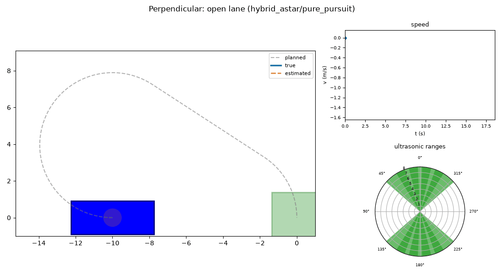
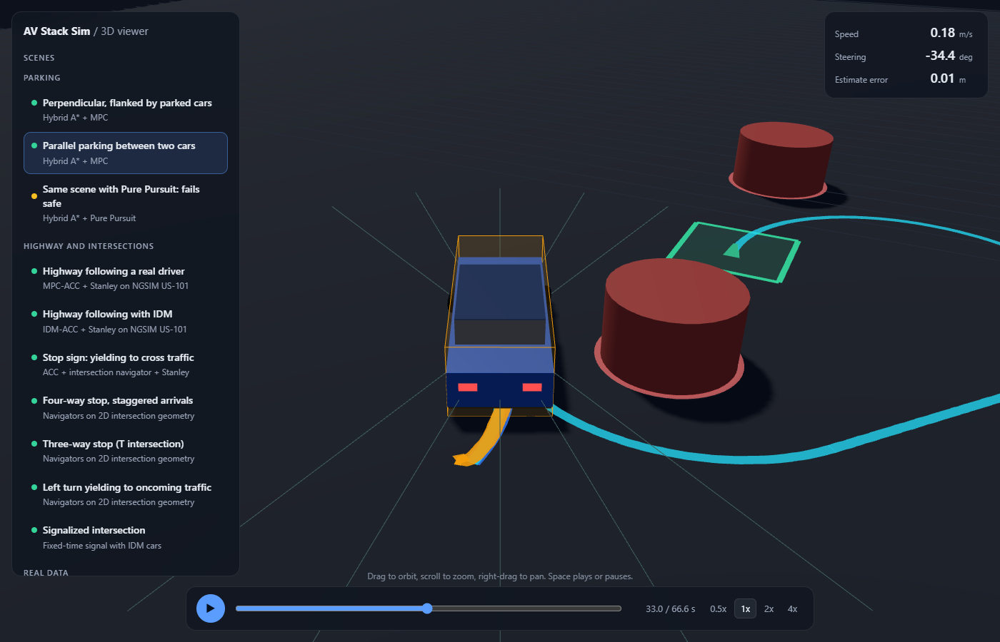
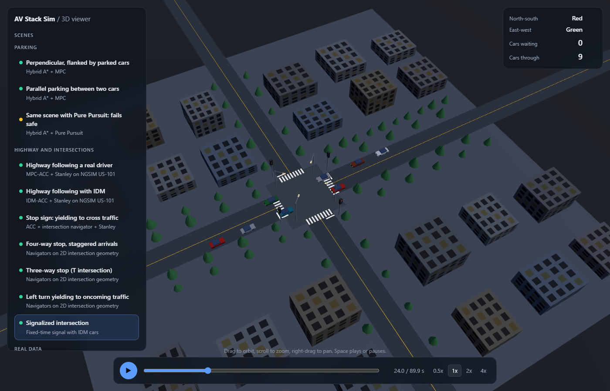
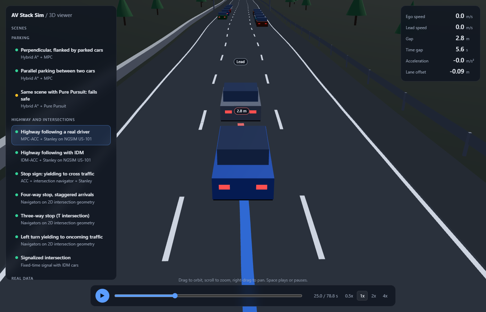
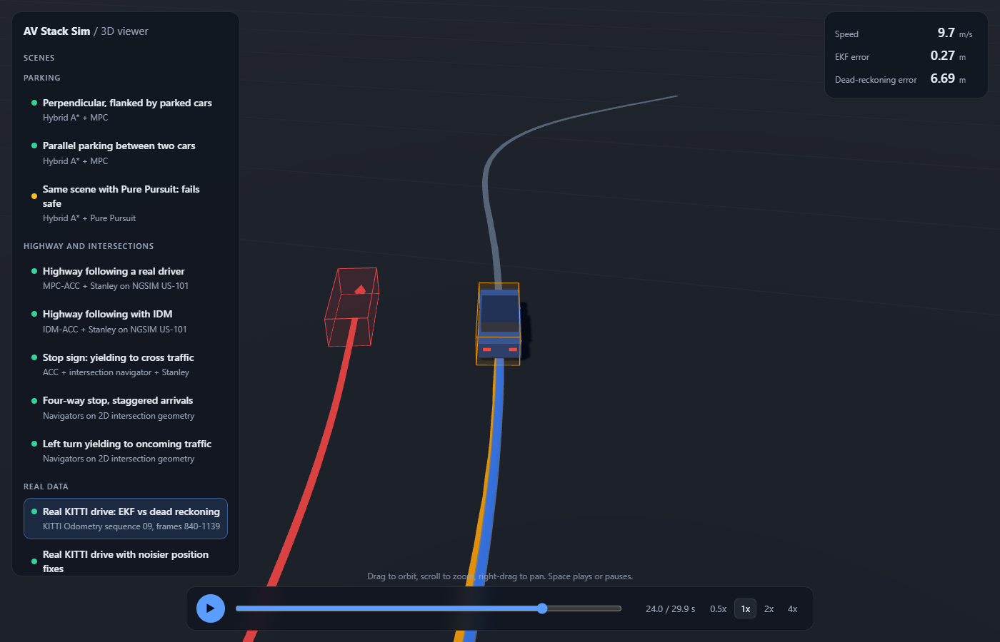
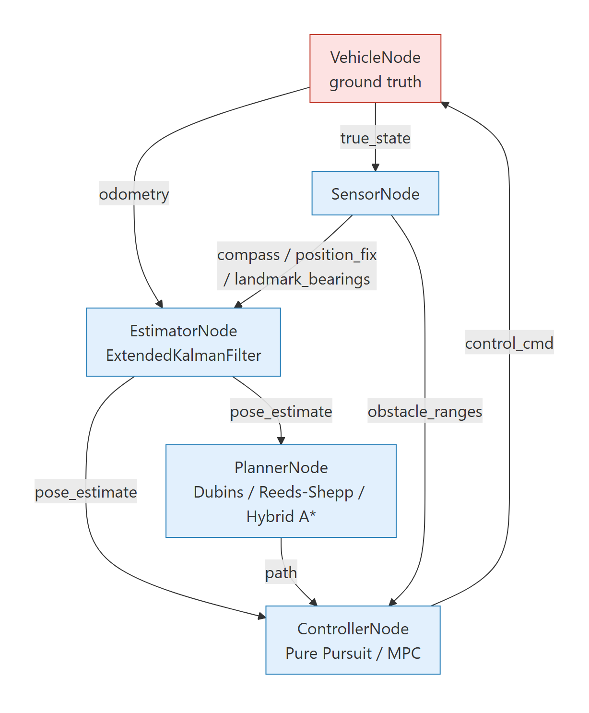
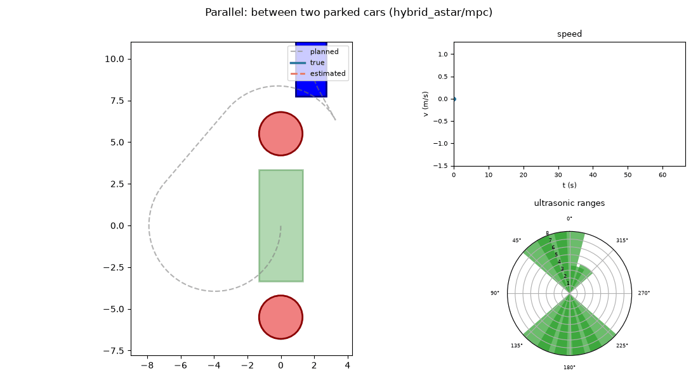
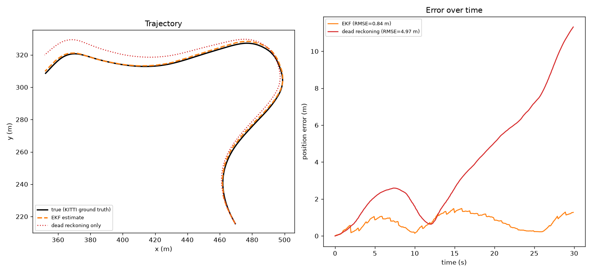
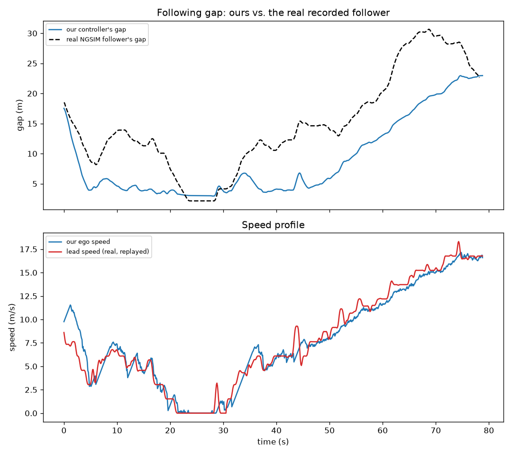
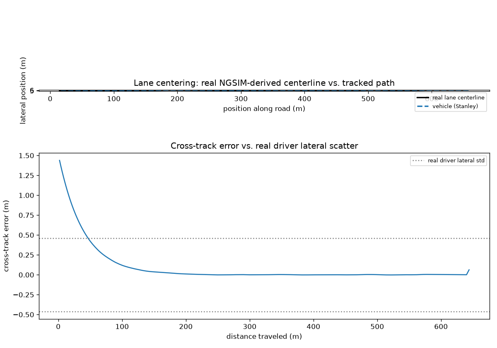

# AV Stack Sim

[](pyproject.toml)
[](tests/)
[](LICENSE)

A from-scratch autonomous-driving stack in Python: state estimation, motion planning, and control
for **parking** (Dubins, Reeds-Shepp, Hybrid A*, Pure Pursuit, MPC) and **highway driving**
(adaptive cruise control, lane centering, intersection navigation). Both modes share one pub/sub
node graph and one Extended Kalman Filter, and are validated against real KITTI and NGSIM
driving data rather than synthetic noise alone.

**[Open the interactive 3D viewer](https://nkabra56.github.io/av-stack-sim/viewer/)**: fourteen
replayable runs in your browser, no install.



*Pure Pursuit tracking a Hybrid A\* plan. Gray: planned path. Blue: true trajectory. Orange: EKF
estimate with its 1σ ellipse. The fan is the ultrasonic sensor array.*

**Contents:** [3D viewer](#interactive-3d-viewer) · [Architecture](#architecture) ·
[What this demonstrates](#what-this-demonstrates) · [Results](#results) ·
[Quickstart](#quickstart) · [Docker](#docker) · [Foxglove export](#foxglove-export) ·
[Project structure](#project-structure) · [Status](#status)

## Interactive 3D viewer

A browser replay of fourteen runs on roads that look like roads: lane markings, guardrails,
crosswalks, sidewalks, STOP signs, working traffic signals, street lights, trees, buildings, and
other cars with brake lights. Three runs are parking. Seven are highway and intersection driving:
car following behind recorded NGSIM traffic (MPC and IDM) with cars in the neighboring lanes, a stop
sign, a four-way stop, a T intersection, a left turn, and a fixed-time signalized intersection. Four
use real data: two KITTI drives, our controller beside a recorded human follower, and lane centering
on a real lane. Each scene lists what to watch and what is real versus simulated. Cars carry name
tags, a colored bar shows the following gap, and the panel shows live speed, gap, time gap,
acceleration and signal state. Switch between follow, overview, and top-down cameras, scrub or speed
up playback, and toggle the planned path, trails, sensor rays, EKF uncertainty, the collision
circle, and the scenery.

| Parking: reverse cusp between two cars | Signalized intersection with queues |
|---|---|
|  |  |

| Highway following with traffic in the other lanes | Real KITTI drive: EKF vs. dead reckoning |
|---|---|
|  |  |

```bash
python -m core.visualization.web_export                 # re-run the scenarios, write docs/viewer/scenes.js
python -m http.server 8000 --directory docs/viewer      # then open http://localhost:8000
```

The page loads three.js from a CDN, so it needs a network connection. Fidelity notes: KITTI supplies the
trajectory while its sensor noise is simulated; the parking collision test is a 1.0 m circle, smaller
than the drawn 4.5 m car; the highway harness locates the ego by nearest waypoint (2 m apart), so
its reported gap can differ from the drawn one by up to 1 m, and the viewer shows the drawn
geometry; cars in the neighboring lanes are simulated background traffic that never interacts with
the ego; and scenery, signs and signals are illustrative and drawn oversized at intersections (see
[DESIGN.md](DESIGN.md#9-known-limitations--assumptions)).

## Architecture

<p align="center"></p>

Nodes talk only through named topics and typed messages. Ground truth (`true_state`, red)
reaches `SensorNode` alone, so the estimator, planner, and controller structurally cannot see it.
A new planner or controller drops in by satisfying `Planner` or `Controller` (`interfaces.py`).
Highway mode uses the same pattern with more nodes (ACC, lane centering, intersection navigation),
composed by a `LongitudinalArbiterNode` that takes the most conservative acceleration command.
Tick order and the full diagram: [DESIGN.md](DESIGN.md#2-system-architecture).

## What this demonstrates

- **Estimation without ground truth.** An EKF fuses odometry with a compass, low-rate position
  fixes, and landmark bearings. Process noise scales with control effort instead of a fixed `Q`,
  and a UKF is compared head-to-head. See [DESIGN.md](DESIGN.md#5-state-estimation).
- **Curvature-feasible planning.** Dubins, Reeds-Shepp, and Hybrid A*. An early Bezier planner
  looked smooth but demanded steering beyond the vehicle's limit; Dubins paths are drivable by
  construction. See [DESIGN.md](DESIGN.md#6-path-planning).
- **Classical vs. optimization-based control, twice.** Pure Pursuit vs. MPC for parking, IDM vs.
  constrained MPC for car following, with Stanley for lane centering. See
  [DESIGN.md](DESIGN.md#7-control) and [DESIGN.md](DESIGN.md#11-adaptive-cruise-control-h1).
- **Real-data validation.** The EKF on a KITTI Odometry excerpt has a median RMSE of 0.91 m over
  20 noise draws, against 3.43 m for dead reckoning (73% lower, better on 19 of 20 draws). Both ACC controllers replay a real 78 s NGSIM traffic
  trace that includes a full stop. Stanley tracks a lane centerline built from about 10,400 real
  vehicle positions.
- **Stochastic evaluation.** Success is a rate over 5 seeds, and safety is asserted on every
  scenario, controller, and seed against ground truth, never the filter's own estimate.
- **Bugs found by validation, and documented.** IDM's textbook formula demanded -1309 m/s² in a
  standalone check, an MPC gap constraint went infeasible at a real traffic standstill, and a
  Pure Pursuit collision traced to a brake trigger that fired at the collision boundary. See
  [KNOWN_BUGS.md](KNOWN_BUGS.md).
- **An RL baseline.** A PPO policy trained in a Gymnasium environment parks without collisions
  across 5 seeds on the open and flanked lots, and is compared with the planner and controller
  stack on success, collisions, and steps ([provenance](core/data/rl/PROVENANCE.md)).
- **Tested and modular.** 312 tests (299 run on a base install; 13 more in 4 modules need the `rl` or `viz` extras),
  ruff-clean, with planners, controllers, and nodes swappable behind common interfaces.

Reasoning and tradeoffs: [DESIGN.md](DESIGN.md). Module breakdown, milestones, and testing:
[IMPLEMENTATION.md](IMPLEMENTATION.md).

## Results

Hybrid A* plans a reverse-gear cusp around both neighboring cars, and MPC tracks it. Pure Pursuit
cannot follow that cusp, so it fails safe there (0/5 success, 0/5 collisions) while MPC succeeds
5/5:



Validation against real data, generated by the commands in [Quickstart](#quickstart):

| EKF vs. real KITTI Odometry | ACC vs. real NGSIM traffic | Stanley vs. a real NGSIM lane |
|---|---|---|
|  |  |  |
| Seed 0 shown: 0.845 m vs. 4.966 m dead reckoning | MPC-ACC on a 78 s congested US-101 trace | Cross-track error inside real drivers' 0.46 m lateral scatter |

KITTI provides the trajectory only, so the odometry, compass, and position-fix noise in that
validation is simulated on top of it.

## Quickstart

```bash
pip install -e ".[dev]"
pytest                                                          # 299 pass; 13 more tests need `rl`/`viz`
ruff check core tests                                           # lint

# Parking
python -m core.demo perpendicular_open                          # Pure Pursuit, show the animation
python -m core.demo parallel_between_cars --controller mpc      # the reverse-cusp obstacle case
python -m core.demo perpendicular_open --save out.gif           # save a GIF

# Validation against real data
python -m core.validation.kitti_ekf_validation --plot out.png
python -m core.validation.acc_validation --controller mpc --plot out.png
python -m core.validation.lane_centering_validation --plot out.png
python -m core.validation.rl_comparison core/data/rl/parking_policy_perpendicular_open.zip perpendicular_open  # needs `.[rl]`
```

Scenarios: `perpendicular_open`, `perpendicular_flanked`, `perpendicular_obstructed_lane`,
`parallel_open`, `parallel_between_cars`. Stack: Python, NumPy, SciPy (SLSQP for MPC), Matplotlib,
PyYAML, pytest, ruff; optional Gymnasium and Stable-Baselines3 (`rl`), Foxglove SDK (`viz`).

## Docker

```bash
docker build -t auto-park --target base .   # core sim and tests
docker run --rm auto-park                   # runs the test suite
docker run --rm -v "$PWD/out:/app/out" auto-park python -m core.demo perpendicular_open --save out/demo.gif

docker build -t auto-park:rl --target rl .  # adds torch (multi-GB), only for training and RL comparison
docker compose run --rm test                # compose wraps the test, demo, and rl-train services
```

The base image and the compose demo are build-verified on Linux; the `rl` target is not. Files
written by `--save` or `--plot` need the mounted `out` volume to survive the container.

## Foxglove export

`python -m core.demo perpendicular_open --foxglove out/demo.mcap` writes an MCAP file for the
[Foxglove desktop app](https://foxglove.dev/download): a 3D scene with the vehicle, obstacles,
spot, true and estimated trajectories, uncertainty ellipse, and sensor fan. It needs
`pip install -e ".[viz]"`. Foxglove's video export is paid, so record the window with OBS or
Game Bar. Setup steps are in [FOXGLOVE_TESTING_GUIDE.md](FOXGLOVE_TESTING_GUIDE.md).

## Project structure

```
core/
  vehicle.py, environment.py, sensors.py, interfaces.py, scenario_loader.py   # bicycle model, lot, sensors, Planner and
                       # Controller protocols, scenarios/*.yaml
  demo.py              # CLI: run a scenario, save a GIF, or export for Foxglove
  messaging/           # Bus and typed messages (the pub/sub backbone)
  estimation/          # ekf.py (3-state parking, 4-state speed-estimating), ukf.py
  planning/            # dubins.py, reeds_shepp.py, hybrid_astar.py
  control/             # pure_pursuit.py, mpc.py, acc.py (IDM + MPC-ACC), lane_centering.py (Stanley),
                       # intersection.py, intersection_geometry.py
  nodes/               # one node per role, for parking and highway
  harness.py, highway_harness.py, intersection_harness.py, intersection2d_harness.py,
  full_highway_harness.py, signalized_intersection.py   # tick-based executors
  background_traffic.py   # IDM cars in the lanes beside the ego (viewer scenes)
  rl/                  # ParkingEnv (Gymnasium) and PPO training
  validation/          # KITTI and NGSIM loaders and validations, RL and UKF comparisons
  visualization/       # animate.py (Matplotlib), foxglove_export.py, web_export.py and scenery.py (3D viewer)
  data/                # committed KITTI and NGSIM excerpts, trained RL policies
docs/
  viewer/              # index.html (three.js viewer) and generated scenes.js
  media/               # README GIFs and plots; architecture.mmd is the source of architecture.png
tests/
```

Full layout: [IMPLEMENTATION.md](IMPLEMENTATION.md#1-directory-structure).

## Status

Parking (M1 to M5: planning, MPC, sensing and re-planning, visualization), the pub/sub
architecture, and real-data EKF validation are done, as are highway H1 to H5 (ACC, fused speed
estimation, lane centering, intersections, and the full closed-loop drive). One gap is open: a
documented sensor-latency limit beyond about 1 to 2 s ([KNOWN_BUGS.md](KNOWN_BUGS.md), entry 7).
Milestone history: [IMPLEMENTATION.md](IMPLEMENTATION.md#3-milestones).

## Data and license

Code is MIT ([LICENSE](LICENSE)). The KITTI excerpt (CC BY-NC-SA 3.0) and the NGSIM excerpts (CC BY-SA 3.0) are
redistributed with attribution in `core/data/*/ATTRIBUTION.md`.
